# CERRA decoder artefacts: completed experiments

**Eighteen training runs have completed. None meets both 1% acceptance limits for both variables.** The final comparison uses **2,560 completed optimizer updates**; the original 400-step run is retained as exploratory, not a matched-budget comparison. Experiments 12/13/20 pass the geopotential boundary criterion alone. Experiment 17 has the lowest whole-field RMSE for both variables; experiment 14 still has the lowest humidity boundary error.

This report includes meaningful trained-model changes and the matched-step control. Launcher/setup failures and configurations that never trained are excluded from the results and plots; their original numbered records remain in the artifact ledger. Experiment numbers are therefore not consecutive.

## Fixed experiment and acceptance criteria

- **Model:** the real WeatherGenerator encoder and decoder, with one **128-dimensional vector per HEALPix cell**, not one global vector or a separate autoencoder. All completed runs use level 5 (`nside=32`), linear source embedding, the native learned `BilinearDecoder`, no extra local/global/aggregation/forecast blocks, and no dropout or EMA. The normal local-to-global cross-attention adapter is retained. Experiments 12–14 and 17–20 interpolate the latent readout; all other runs use the owning cell.
- **Data:** the same CERRA sample at **1985-01-01T00:00**, with `r_850` and `z_500` as both input and same-time target. No source/target shuffling or masking; all native target points are retained.
- **Crop:** rows and columns `[267:801]` from the original `1069 × 1069` grid, selected by `trim_edge: [267, 268, 267, 268]`. This is a contiguous **534 × 534** crop: **285,156 points**, or 24.953249% of the original cells.
- **Geometry:** 242 occupied HEALPix cells and **21,141** horizontal/vertical native-grid neighbor pairs crossing cell boundaries. Labels use the tokenizer's nested ordering and longitude phase: `theta=(90-latitude)*pi/180`, `phi=(longitude+180)*pi/180`.
- **Verification:** each completed result below was reproduced by a separate native inference process loading its saved checkpoint with **all weights matching**. The independent float64 scorer checks the complete crop, original coordinate order, timestamp, finite values and original physical target values.

For each variable, let `e = prediction - target` and `s = std(target, ddof=0)` over the crop. Both must hold:

1. **Normalized RMSE:** `sqrt(mean(e**2)) / s <= 0.01`.
2. **Normalized boundary error:** `sqrt(mean((e[j]-e[i])**2)) / s <= 0.01` across all horizontal/vertical crossing pairs, pooled by pair count. This measures jumps in the **residual**, not natural gradients in the target. No diagonal neighbors, periodic wrap or pairs outside the crop are included.

All percentages below are these normalized quantities multiplied by 100. **Every error column must be ≤1%.**

## Matched-step comparison

| Experiment | Architecture | Completed updates | `r_850` RMSE | `r_850` boundary error | `z_500` RMSE | `z_500` boundary error | Train + inference GPU time |
|---|---|---:|---:|---:|---:|---:|---:|
| **09** | Linear | **2,560** | 40.23% | 48.30% | 7.54% | 9.78% | 22m47s |
| **06** | MLP coordinates | **2,560** | 34.89% | 46.50% | 4.24% | 6.03% | 23m05s |
| **11** | MLP + per-cell queries | **2,560** | 30.41% | 38.93% | 2.75% | 4.40% | 23m57s |
| **12** | Interpolated latents + global XYZ MLP | **2,560** | 45.91% | 9.32% | 15.69% | **0.83% — passes** | 20m07s |
| **13** | Interpolated latents + per-cell queries + XYZ | **2,560** | 40.82% | 9.31% | 5.06% | **0.84% — passes** | 20m31s |
| **14** | Interpolated latents + per-cell queries + Fourier | **2,560** | 6.89% | **3.65%** | 4.68% | 1.85% | 22m29s |
| **17** | Fourier + FP32 coordinate/readout arithmetic | **2,560** | **4.80%** | 3.71% | **2.53%** | 1.64% | 22m23s |
| **18** | Fourier + FP32 + linear LR decay | **2,560** | 5.37% | 4.00% | 2.87% | 1.92% | 22m48s |
| **19** | Fourier ON, fixed-width ablation | **2,560** | 4.87% | 3.78% | 2.63% | 1.75% | 23m09s |
| **20** | Fourier OFF, same network and input width | **2,560** | 39.71% | 9.13% | 3.54% | **0.62% — passes** | 20m04s |
| **21** | Basic linear + referenced branch absolute coordinates | **2,560** | 33.43% | 42.06% | 12.85% | 15.81% | 23m46s |
| **22** | Basic linear + global XYZ/Fourier coordinates | **2,560** | 28.58% | 37.58% | 26.80% | 32.91% | 20m36s |
| **23** | Linear + per-cell queries + branch absolute coordinates | **2,560** | 32.39% | 41.61% | 10.28% | 14.19% | 23m53s |
| **24** | Linear + per-cell queries + global XYZ/Fourier | **2,560** | 25.13% | 33.10% | 22.50% | 25.35% | 21m10s |
| **25** | Fourier MLP + per-cell queries, hard cell readout | **2,560** | 4.97% | 7.82% | 3.30% | 5.46% | 21m24s |
| **26** | Fourier MLP + shared query, hard cell readout | **2,560** | 5.37% | 8.67% | 3.56% | 5.81% | 23m56s |
| **27** | Tameer absolute MLP + shared query, hard cell readout | **2,560** | 21.70% | 26.26% | 3.45% | 6.01% | 26m46s |

At the same update count, experiment 06's MLP has lower errors than experiment 09's linear embedding on all four measures. Relative reductions are **13.28% / 3.73%** for humidity RMSE / boundary error and **43.73% / 38.34%** for geopotential. Per-cell queries improve reconstruction further without removing seams. Interpolated readout strongly reduces boundary error but worsens absolute reconstruction; smoothness is not accuracy.

All matched runs used eight data workers and the same base optimizer settings. Learning rate is constant 0.001 except experiment 18's linear decay to 0.00001. Native fresh-run seed variability was accepted by the user; 19/20 share the untrained weights already prepared before the user requested no further initialization checks. These are single realizations, not statistically replicated comparisons. Parameter counts differ across earlier architectures; the comparison matches updates, not elapsed time.

## Shared `r_850` target and plot scale

The target below is common to all eighteen runs. Every plotted reconstruction uses its **target-derived** color limits, **[0, 100.107421875]**, and actual HEALPix boundaries are overlaid. Values outside that display range saturate the colors only; predictions and metrics are not clipped or postprocessed.

The field maps embedded here are unchanged copies of the native evaluator's independently reloaded outputs. Relative image paths keep them viewable with the repository rather than depending on cluster-only image links. Target, reconstruction and symmetric-residual maps for **both** variables are available. The requested 19/20 figures below were generated afterward from their existing saved outputs, without training or inference reruns.

## Reading the loss curves

- **Pale solid line:** native logged training-window averages. **Dashed line with crosses:** validation snapshots, including the untrained model at update 0. No additional smoothing is applied; initial transients are retained.
- **Horizontal axis:** optimizer update counter. The native logger calls this `num_samples`; it equals the update counter here because each update uses one sample on one GPU without gradient accumulation.
- **Vertical axis:** native normalized MSE averaged over `r_850` and `z_500`, on a logarithmic scale. This is **not** the crop-normalized RMSE percentage or boundary-error criterion.
- Training and validation use the **same date and crop**. Their agreement measures repeatability of this overfit, not generalization. `X` in the native legend means the run is inactive, not that plotting failed.

For scale, the crop's standard deviations in dataset-normalized units are **0.81525 / 0.53607**. Satisfying both 1% RMSE limits would require their mean native MSE to be **at most 4.75998e-5** (`0.01² × mean(crop_std²)`). That aggregate ceiling alone is not sufficient to pass either the per-variable or boundary checks. The completed curves remain far above it.

Curves use `TrainLogger.read` and the existing `plot_loss_per_stream` function. Raw metric snapshots, plot hashes and point counts are retained under each `attempt-NN/loss_plots/`; the replay recipe is `plot_report_losses.py` in the campaign directory.

## Experiment 05 — exploratory linear baseline, 400 updates

**Change tested:** establish the simplified native WeatherGenerator autoencoding control, with linear coordinate embedding and one latent vector per cell. Training used one data worker and four 100-update mini-epochs.

| Completed updates | `r_850` RMSE | `r_850` boundary error | `z_500` RMSE | `z_500` boundary error | Outcome |
|---:|---:|---:|---:|---:|---|
| 400 | 47.74% | 64.13% | 24.17% | 28.16% | Failed |

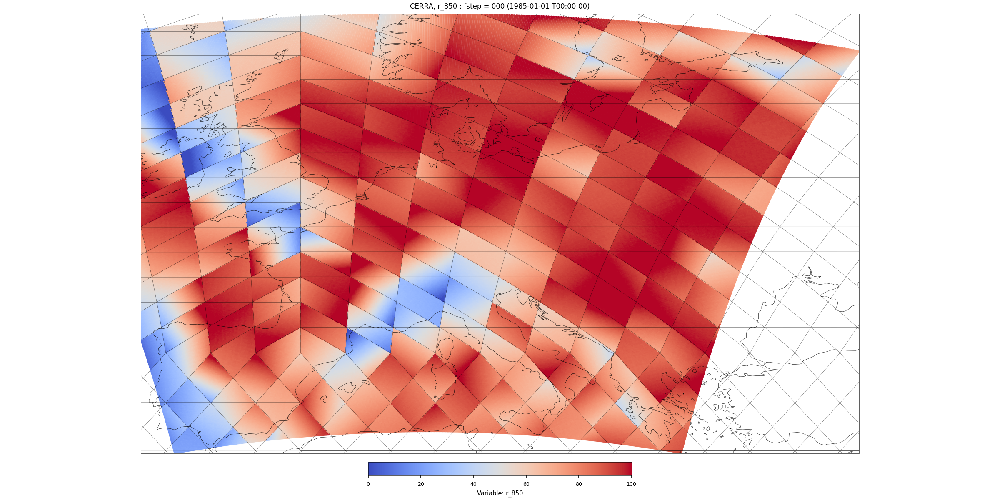

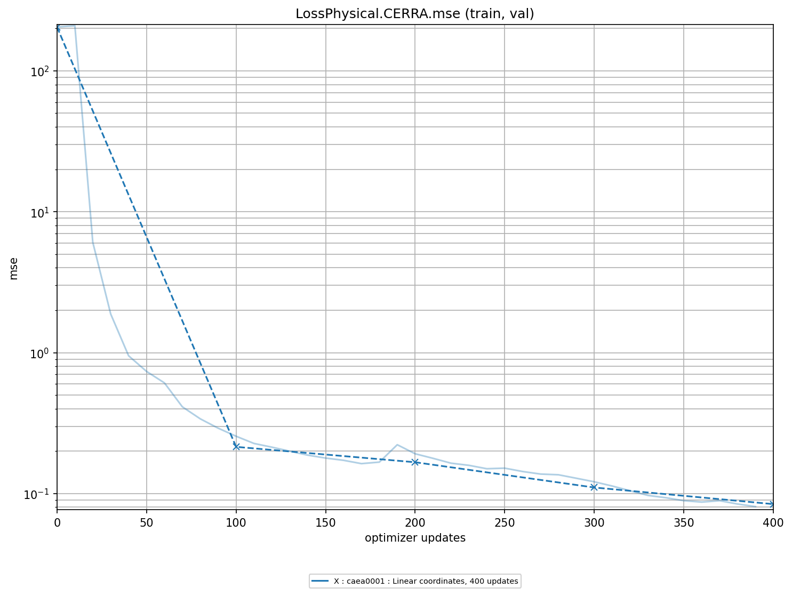

Final recorded validation MSE: **0.08411959**. The curve contains 40 training records and 5 validation snapshots.

**Observed:** the humidity reconstruction contains pronounced cell-shaped blocks and misses within-cell fine structure. The numerical errors confirm that this is not merely a plotting artefact.

**Lesson:** 400 updates were not enough to assess convergence or claim a hard capacity limit. One data worker delivered roughly 0.315 updates/s; the run spent 23m15s in training. The subsequent requirement for equal update counts led to the completed **experiment 09 rerun**. Do not use this shorter result as the final linear-versus-MLP comparison.

**Evidence:** `caea0001` → independent inference `caei0001`, checkpoint 4; 1,395 s training + 99 s inference = **24m54s** on one GPU. Native validation MSE `0.08411958813667297` was reproduced after reload. Full results and lessons: `attempt-05/independent_metrics.json` and `attempt-05/report.md`.

## Experiment 06 — nonlinear coordinate embedding, 2,560 updates

**Change tested:** replace the native linear coordinate embedding with the existing native MLP. Keep the same bilinear decoder, source embedding, crop, variables and one-vector-per-cell bottleneck. Increase training to 10 × 256 updates and use eight data workers.

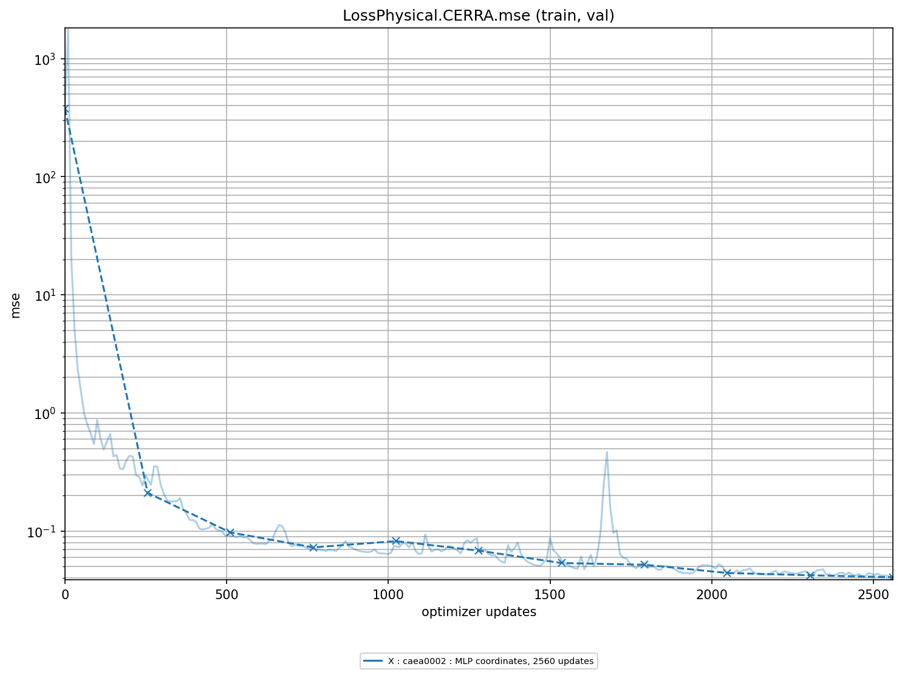

Final recorded validation MSE: **0.04071475**. The curve contains 260 training records and 11 validation snapshots; transient training spikes remain visible rather than being smoothed away.

**Observed:** broad humidity features improve, but strong cell-shaped patches remain and narrow structures visible in the target are lost. Geopotential looks considerably smoother on its target-derived scale, while its residual map still reveals cell-aligned offsets.

**Optimization evidence:** within this run, extending from 1,280 to 2,560 updates changed humidity RMSE / boundary error from **43.67% / 50.80%** to **34.89% / 46.50%**, and geopotential from **18.46% / 25.55%** to **4.24% / 6.03%**. Early 100-step previews were not convergence evidence.

**Lesson:** the MLP adds within-cell nonlinearity but does not remove the hard owner-latent or coordinate-frame switches. Comparison against experiment 05 alone confounds architecture with optimization duration; experiment 09 supplies the required matched-step control. Even after that control, this remains a single-seed observation, not proof of seed-robust causality or an irreducible capacity limit.

**Evidence:** `caea0002` → `caei0002`, checkpoint 10; 1,284 s training + 101 s inference = **23m05s** on one GPU. Native validation MSE `0.040714751929044724` and all four independent metrics were reproduced exactly after reload. Its six independent PNGs byte-match the visually inspected final-validation maps. Full results, plot hashes and lessons: `attempt-06/independent_metrics.json`, `plot_verification.json` and `report.md`.

## Experiment 09 — matched-step linear rerun, 2,560 updates

**Change tested:** rerun the linear-coordinate architecture at exactly the same **2,560 completed updates** and eight-worker setup as experiment 06. Relative to that MLP run, the effective configuration differs only in coordinate net, run/tag/directory identifiers and the accepted native seed variation.

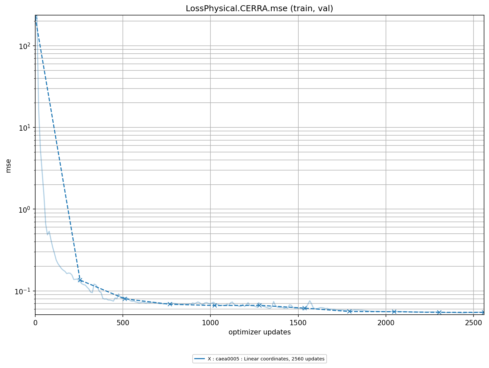

Final recorded validation MSE: **0.05461121**. The curve contains 260 training records and 11 validation snapshots.

**Observed:** longer optimization improves the linear model, but the humidity field still has conspicuous planar-looking cell facets, sharp boundary transitions and missing fine filaments. Geopotential reproduces the broad gradient, yet its residual map exposes widespread sharply bounded cell offsets.

**Lesson:** at equal update count, the MLP is better on all four measured errors, but its humidity boundary improvement is only **3.73%** relative to this linear control. Reducing reconstruction loss does not by itself establish boundary continuity. This run supersedes experiment 05 for the final architecture comparison.

**Evidence:** `caea0005` → `caei0005`, checkpoint 10; final saved configuration records `general.istep=2560`. Training used 1,260 s and independent inference 107 s: **22m47s** on one GPU. Full metrics, effective configuration diff, six maps and lessons: `attempt-09/independent_metrics.json`, `effective_config_diff_attempt06.json` and `report.md`.

## Experiment 11 — per-cell queries, 2,560 updates

**Change tested:** enable the native `ae_local_queries_per_cell` path, repaired for NumPy/Astropy interoperability and correct auxiliary-token batching. Keep the MLP coordinates and hard owner-cell readout from experiment 06. The bottleneck remains one 128-D vector per cell; the global learned query table increases total parameters from **468,644 to 2,041,380**.

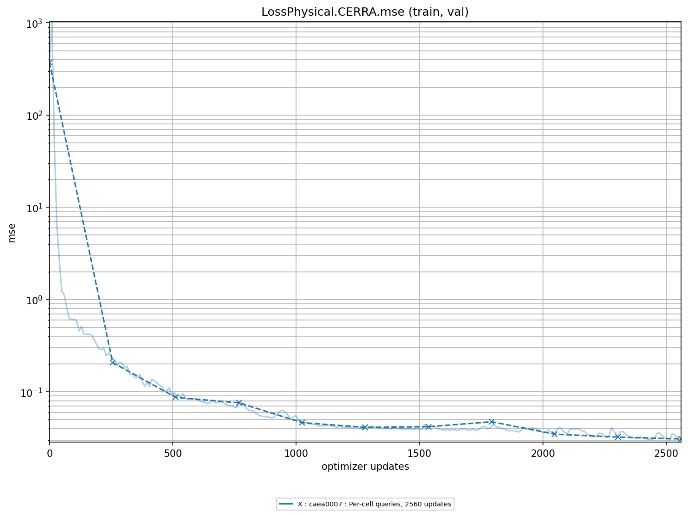

Final recorded validation MSE: **0.03083721**. The curve contains 260 training records and 11 validation snapshots.

**Observed:** humidity still has conspicuous cell facets and missing fine fronts. Geopotential reproduces the broad field closely on the target scale, but its symmetric residual map reveals widespread sharply bounded cell-shaped errors. All four acceptance metrics fail.

**Lesson:** compared with experiment 06, normalized RMSE / boundary error decrease by **12.85% / 16.27%** for humidity and **35.24% / 27.06%** for geopotential. Location-specific learned queries help this overfit but do not enforce continuity. More parameters and different initialization prevent a capacity-neutral or seed-controlled causal claim.

**Evidence:** `caea0007` → `caei0007`, checkpoint 10, all weights matching and saved `general.istep=2560`; 1,334 s training + 103 s inference = **23m57s** on one GPU. Native final and independent validation losses match. Full native GPU encoder/decoder training confirms the query repair beyond the earlier CPU preflight. Metrics, six inspected maps, query shape `[12288,1,128]`, hashes and lessons are in `attempt-11/`.

## Experiment 12 — continuous interpolated readout, 2,560 updates

**Change tested:** replace hard owner-latent lookup with four-neighbor HEALPix interpolation and use owner-independent unit-sphere XYZ/time coordinates. Keep the existing learned bilinear decoder, shared query, and 840 → 128 coordinate-network widths. Removing owner-dependent features changes the coordinate input from 105 to 9 and reduces total parameters to **387,812**. This is a joint architecture change, not an isolated interpolation ablation.

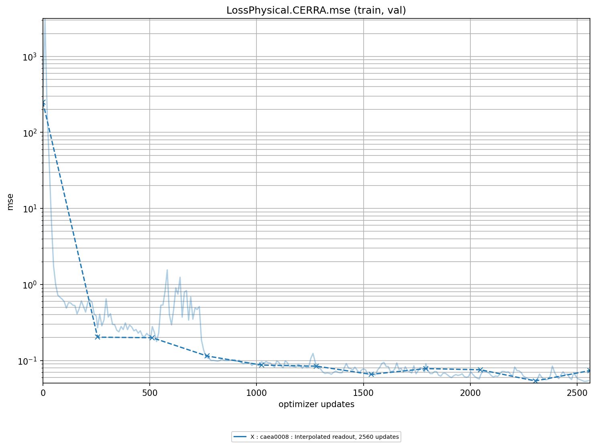

Final recorded validation MSE: **0.07358271**. The curve contains 260 training records and 11 validation snapshots. Large transient spikes and late fluctuations are retained; the final validation point is not the minimum.

**Observed:** hard cell-edge jumps become much less conspicuous, but humidity fronts are rounded into broad blobs. The geopotential residual has substantial smooth west/southwest-negative and east/northeast-positive structure. Its **0.83% boundary error passes**, while its **15.69% normalized RMSE fails**. Humidity fails both at **45.91% / 9.32%**.

**Lesson:** relative to experiment 06, boundary error decreases by **79.95%** for humidity and **86.22%** for geopotential, while RMSE increases by **31.58%** and **269.63%**, respectively. Smooth residuals can satisfy the local-jump criterion despite large absolute bias. Continuity alone does not recover fine humidity structure or guarantee either finite-grid threshold; reduced coordinate features, parameter count, initialization and optimization remain confounders.

**Evidence:** `caea0008` → `caei0008`, checkpoint 10, all weights matching and saved `general.istep=2560`; 1,099 s training + 108 s inference = **20m07s** on one GPU. Native final and independent validation losses match. Complete metrics, six inspected maps, source/checkpoint hashes and lessons are in `attempt-12/`.

## Experiment 13 — combined interpolation and per-cell queries, 2,560 updates

**Change tested:** combine the per-cell query table from experiment 11 with experiment 12's continuous 9-feature XYZ readout. Total parameters: **1,960,548**; coordinate MLP **9 → 840 → 128**. No Fourier features or raw-field bypass.

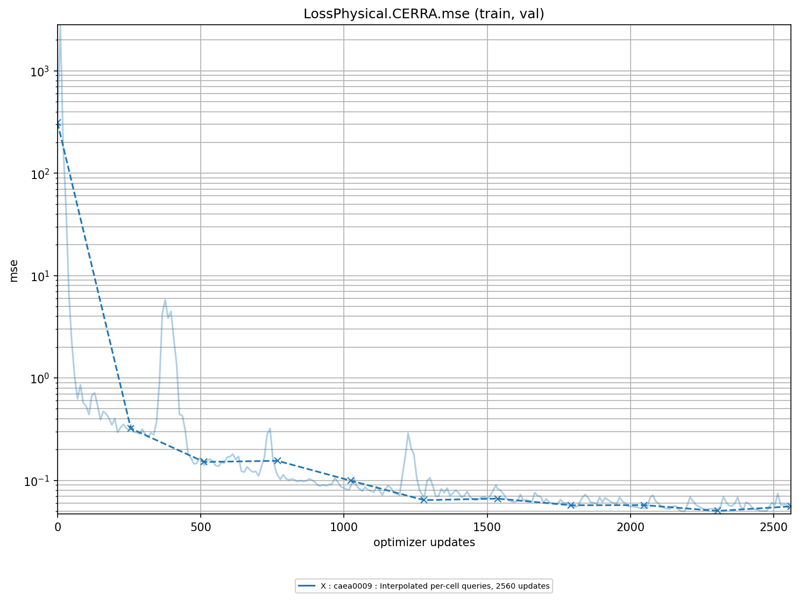

Final recorded validation MSE: **0.05572963**. The curve contains 260 training records and 11 validation snapshots; early and intermediate spikes remain visible.

**Observed:** humidity retains broad wet/dry geography but rounds narrow fronts into smooth patches. Geopotential looks close on the fixed full-field scale, while its residual retains coherent smooth lobes. Its boundary error still passes, but its **5.06% normalized RMSE does not**.

**Lesson:** versus experiment 12, per-cell queries reduce humidity/geopotential RMSE by **11.10% / 67.73%**, while both boundary errors change by less than 1% relative. Combining the mechanisms improves absolute fitting without recovering fine humidity structure. Versus hard-readout experiment 11, boundary errors improve substantially but both RMSEs worsen. Capacity and initialization differ; this is not a controlled causal or convergence claim.

**Evidence:** `caea0009` → `caei0009`, checkpoint 10, all weights matching, saved `general.istep=2560`; 1,098 s training + 133 s inference = **20m31s** on one GPU. Final native validation loss matches independent inference. Complete metrics, six inspected maps, 388 matching training/inference source/config hashes, archived checkpoint/output and lessons are in `attempt-13/`.

## Experiment 14 — multiscale continuous Fourier coordinates, 2,560 updates

**Change tested:** enrich experiment 13's owner-independent coordinates with 96 global sine/cosine features. The coordinate MLP returns to **105 → 840 → 128** and total parameters to **2,041,380**, matching experiment 11's count; this is **80,832 more** than experiment 13. Latent interpolation and the single 128-D per-cell bottleneck remain unchanged.

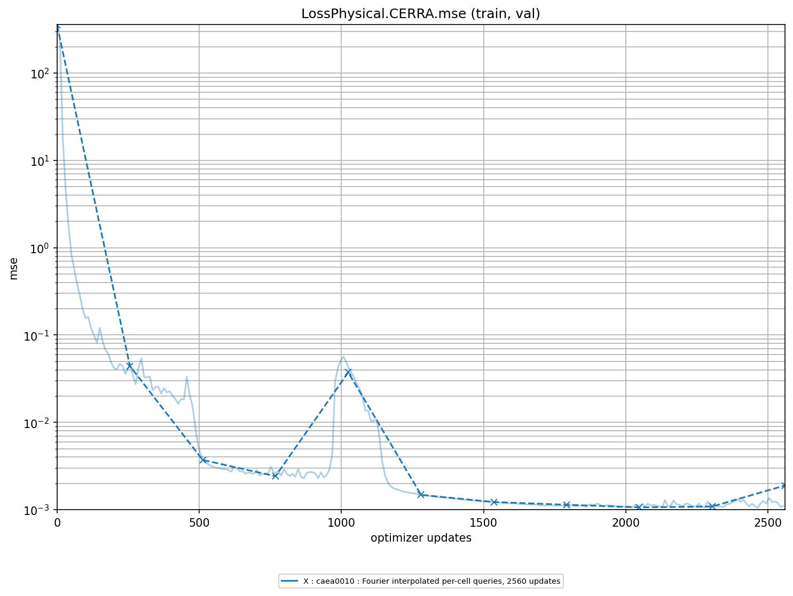

Final recorded validation MSE: **0.00189353**. The curve contains 260 training records and 11 validation snapshots. A pronounced excursion near update 1,000 and the final validation increase are retained. The last logged training-window mean is **0.00110806**; neither value establishes convergence.

**Observed:** the humidity map recovers much of the narrow Britain/France dry band and Mediterranean detail; hard cell facets are no longer the dominant error. It is substantially closer to the target, not numerically accepted. Geopotential develops fine mottled residual texture over broader biases, increasing adjacent residual variation.

**Lesson:** versus experiment 13, humidity RMSE / boundary error decrease by **83.11% / 60.75%**. Geopotential RMSE improves **7.65%**, but its boundary error increases **121.09%**, losing the boundary-only pass. All four criteria fail. This run fits fine humidity structure better, but changed input width, parameter count and uncontrolled initialization prevent a pure Fourier-effect claim. Parameter-count matching against experiment 11 does not isolate the joint coordinate/interpolation change either.

**Evidence:** `caea0010` → `caei0010`, checkpoint 10, all weights matching, saved `general.istep=2560`; 1,236 s training + 113 s inference = **22m29s** on one GPU. Native final/inference losses match and 381 frozen source/config hashes match. Six inspected maps, exact metrics and lessons are in `attempt-14/`. Original training-launcher stdout capture was lost to an Eval interruption; the exact command, generated scripts, native logs, scheduler records and checkpoint remain preserved, with an explicit capture-loss note and no resubmission.

## Experiment 17 — FP32 Fourier coordinate/readout arithmetic, 2,560 updates

**Change tested:** retain experiment 14's **105 → 840 → 128** coordinate MLP, per-cell queries, interpolated latents and **2,041,380 parameters**, but set `decoder_full_precision: true`. Coordinate embedding and bilinear readout use float32 outside autocast; the native initializer disables CUDA matmul TF32. Attention remains bf16; LR stays 0.001.

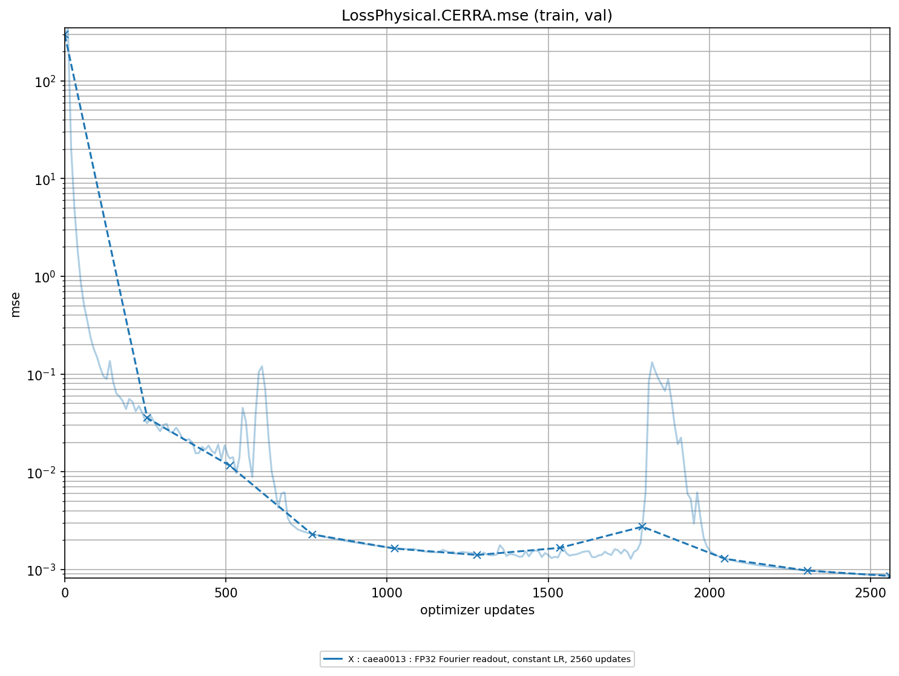

Final recorded validation MSE: **0.0008589569**. The curve contains 260 training records and 11 validation snapshots. Intermediate spikes and the slow late decline are retained; the last training-window mean is **0.0008618991**.

**Observed:** narrow humidity structures remain close to the target, without dominant hard cell facets. Native geopotential maps still contain fine mottled residuals. All four numerical criteria fail.

**Lesson:** relative to 14, humidity/geopotential RMSE fall **30.32% / 45.85%**. Geopotential boundary error falls **11.22%**, but humidity boundary error rises **1.48%**. Lower aggregate loss and higher arithmetic precision do not ensure every boundary criterion improves. Initialization was not controlled, so this is not a causal precision estimate.

**Evidence:** `caea0013` → `caei0013`, checkpoint 10, all weights matching and saved `general.istep=2560`; 1,217 s training + 126 s inference = **22m23s** on one GPU. Native final/inference losses agree. All 400 archived training/inference source/config/dependency hashes match, including `uv.lock`. Exact checkpoint/output, six opened maps, metrics and lessons are in `attempt-17/`.

## Experiment 18 — FP32 Fourier readout with linear LR decay, 2,560 updates

**Change tested:** use experiment 17's architecture and precision settings, with the existing native linear scheduler from **0.001 to 0.00001**. The two warmup steps, one cooldown step, Adam betas and update budget are unchanged.

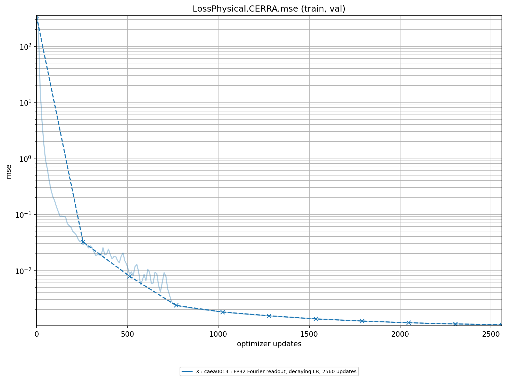

Final recorded validation MSE: **0.0010752641**. The curve contains 260 training records and 11 validation snapshots. Early spikes give way to a smooth, slow decline; the last training-window mean is **0.0010759834**. All 260 actual logged learning rates exactly match the preflight schedule at their recorded indices.

**Observed:** humidity retains fine geography but softens some narrow features. Geopotential has fine mottling despite a close broad-field match. All four criteria fail.

**Lesson:** relative to 14, humidity/geopotential RMSE fall **22.15% / 38.67%**, while boundary errors rise **9.59% / 3.97%**. Constant-LR experiment 17 is better on all four measures in these runs; their different native initializations prevent attributing the difference solely to scheduling. Smoothly decreasing loss is not evidence of acceptance or convergence.

**Evidence:** `caea0014` → `caei0014`, checkpoint 10, all weights matching and saved `general.istep=2560`; 1,242 s training + 126 s inference = **22m48s** on one GPU. Native final/inference losses agree. All 388 archived training/inference source/config/dependency hashes match, including `uv.lock`. Exact checkpoint/output, six opened maps, metrics, actual LR trace and lessons are in `attempt-18/`.

## Experiments 19/20 — Fourier ON versus OFF, 2,560 updates each

**Change tested:** enable or zero the 96 Fourier inputs, keeping the **105 → 840 → 128** MLP, **2,041,380 parameters**, per-cell queries, interpolation, bf16 precision and constant LR 0.001 unchanged. Both native runs completed 2,560 updates and their final checkpoints were used for native inference and the unchanged scorer.

| Fourier features | Final native validation MSE | Outcome |
|---|---:|---|
| ON — experiment 19 | 0.0008878071 | All four 1% limits fail |
| OFF — experiment 20 | 0.0525852069 | Only geopotential boundary limit passes |

**Result:** Fourier ON reduces humidity RMSE by **87.73%** and its boundary error by **58.61%**. Geopotential RMSE improves **25.76%**, but its boundary error increases **184.69%** (2.85×). Native mean MSE is **59.23× lower** with Fourier ON. The features strongly help this humidity reconstruction; they do not solve the smooth-field boundary criterion.

**Runs:** ON `caea0015` → `caei0015`, jobs **880741 / 880770**, 1,257 + 132 = **1,389 one-GPU seconds**. OFF `caea0016` → `caei0016`, jobs **880740 / 880773**, 1,135 + 69 = **1,204 one-GPU seconds**. Both use final checkpoint 10. OFF inference required recovery from two zero-GPU setup failures; training was not repeated. Exact scores are in `attempt-19/independent_metrics.json`, `attempt-20/independent_metrics.json` and `fourier_on_off_results.json`.

### Humidity and geopotential maps

Target/reconstruction color limits are identical across ON/OFF: **r_850 [0, 100.107421875]**, **z_500 [51855.8828125, 56579.3828125]**. Residual maps use their own symmetric color scales; read the colorbars when comparing magnitudes. All are native plots of the saved inference outputs, without additional smoothing.

#### r_850 — humidity

| Fourier ON — experiment 19 | Fourier OFF — experiment 20 |
|---|---|
|  |  |
| 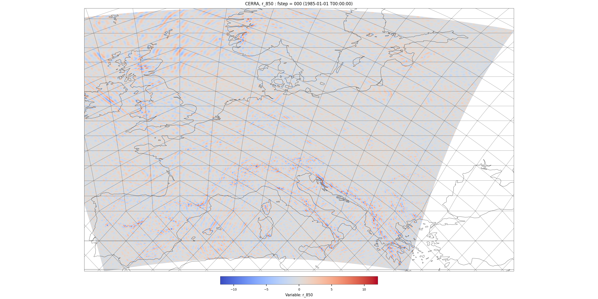 | 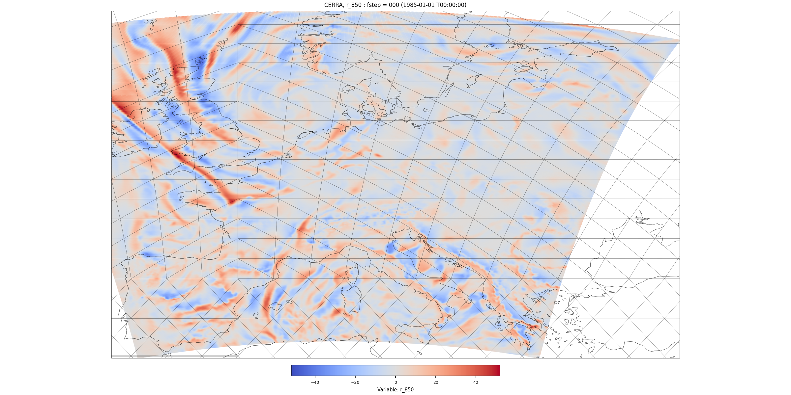 |

#### z_500 — geopotential

| Fourier ON — experiment 19 | Fourier OFF — experiment 20 |
|---|---|
|  | 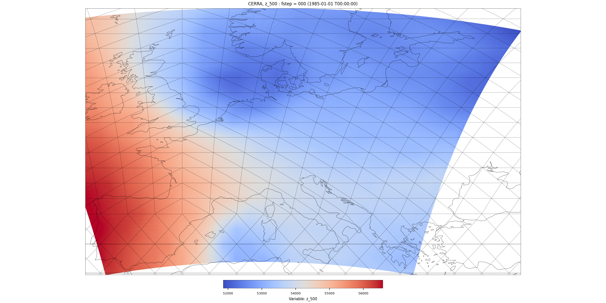 |
| 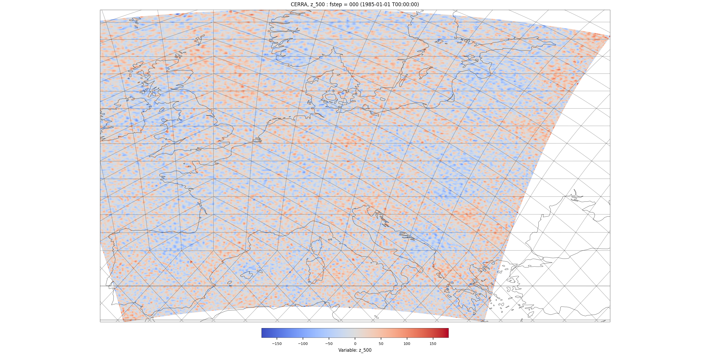 | 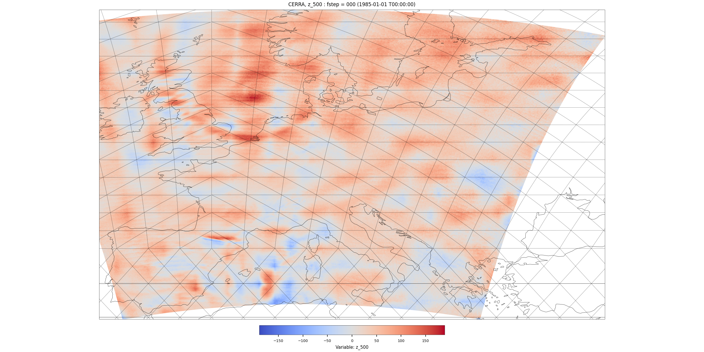 |

### Fourier ablation loss curves

Native training/validation mean MSE over **both r_850 and z_500**. Each curve contains 260 training records and 11 validation snapshots; logarithmic vertical axes have their own ranges.

| Fourier ON — experiment 19 | Fourier OFF — experiment 20 |
|---|---|
| 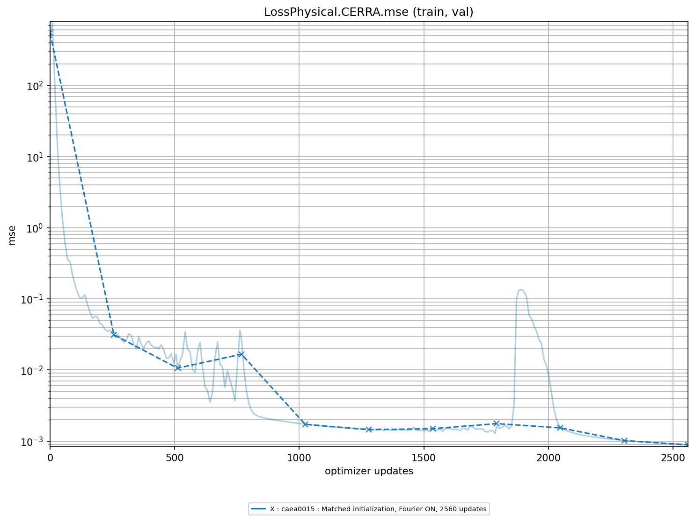 | 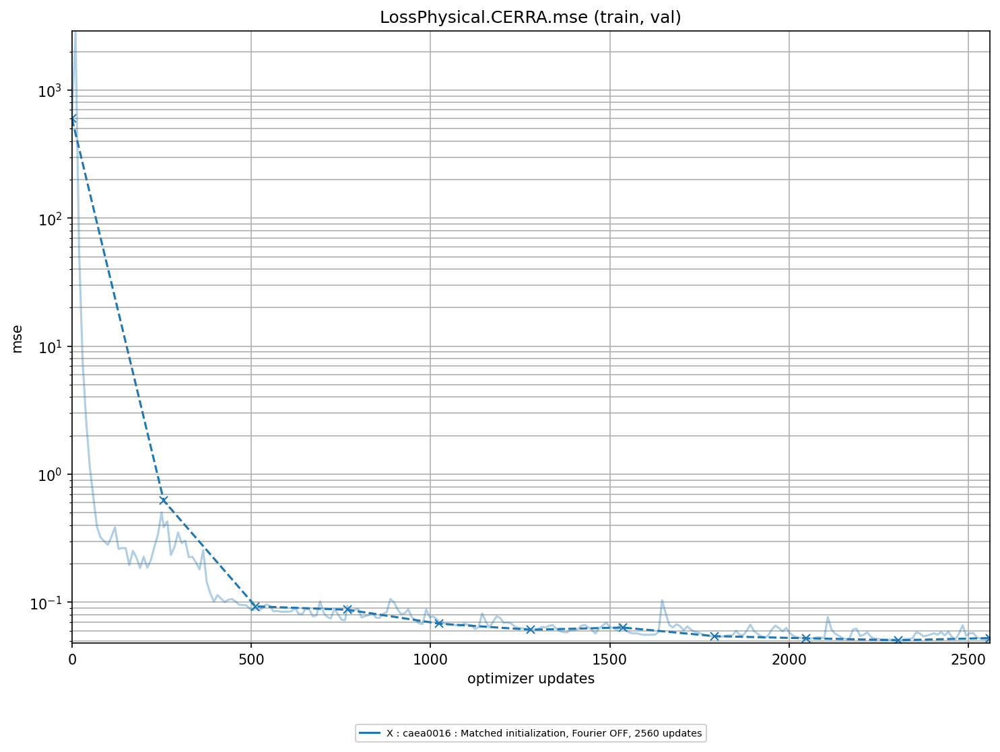 |

## What has not been tested successfully

Setup-only attempts and preflight failures are retained in the full artifact ledger, not presented as trained-model results:

- Earlier **cell-specific-query** attempts failed during environment setup and native Torch/Astropy construction. They are setup records, superseded by the completed experiment **11**, not additional trained-model results.
- The **attention-decoder** comparison was held before submission because the native Classic implementation hardcodes dropout 0.1; other named decoder routes also have construction problems. No reconstruction is attributed to these configurations.
- Precision submissions **15/16** stopped before native training: an accidentally appended positional `.` caused `sbatch` rejection, and a second `--export` replaced required launcher stage/config variables. They consumed **0 / 6 GPU-seconds** and produced no checkpoints or accuracy results. Exact failures remain in their attempt directories; corrected comparisons use new attempt numbers.
- **Local decoder refinement** has not been added or trained. Experiment 12 evaluates interpolation and global coordinates only. No raw source/target pixels bypass the bottleneck.

A smaller-token second input stream is not a finer latent grid in the current implementation: all streams share the global HEALPix level. The learned `BilinearDecoder` is an algebraic product; experiment 12 adds spatial interpolation before it. [PixelDiT](https://pixeldit.github.io/) provides useful cross-patch communication ideas, but its [patch/pixel architecture](https://arxiv.org/html/2511.20645v2) does not itself guarantee continuity or either 1% criterion.

## Current readout and removal verification

The experimental `Interpolated` decoder, four-neighbor latent blending, interpolation metadata, and dedicated experiment launch configurations have been removed. Experiment 25's **global XYZ/Fourier encoding, 105 → 840 → 128 coordinate MLP, per-cell learned queries, and hard owning-cell readout** remain unchanged. `decoder_full_precision` remains supported for `Linear`. Historical results, plots and checkpoints are retained; interpolated experiments require their archived source and configurations.

**Removal verification:** four decoder checks passed, covering owning-cell selection, Fourier ablation, sample/gradient isolation, coordinate variants, and full-precision readout. A CPU smoke check loaded all 285,156 native targets through experiment 25's pipeline configuration and decoded eight targets from eight owning cells. Forward/backward passed through the coordinate MLP and bilinear decoder, with no gradients to non-owning-cell queries. It used query-plus-positional latents, not encoder attention or retraining. Ruff passed for all six affected Python files.

## Transfer to joint 3-hour CERRA forecasting

Initial attempt **`ghzr59sj`** transfers the successful decoder/query pattern to joint forecasting run **`mmfsjhph`** from `rradev/cerra_decode_split`. The pipeline is `config/pipeline_cerra_forecast_fourier_mlp.yml`, using `config/config_forecasting.yml` as its base and `config/forecasting_cerra_fourier_mlp.yml` as the override.

- Retained: 72 source channels, targets `r_850` and `z_500`, `trim_edge: 100`, 375,000 sampled targets, nine geoinfo channels, 2048-dimensional latents, four global blocks, 16 forecast blocks, bf16/FSDP, the original dates/optimizer/EMA, and 128 × 4096 training samples.
- Changed: owner-independent XYZ plus the same 96 Fourier features, an **114 → 912 → 256** coordinate MLP, hard-cell bilinear decoding, and **12,288 separate learned queries**, one 2048-D latent per cell. No latent interpolation or checkpoint warmstart.
- Initialization prerequisite: native meta/FSDP resets previously left query and bilinear parameters uninitialized. Resets now cover both, preserving the eager initialization distributions and per-cell metadata, including sharded parameters. The new finite-prediction/learning regression failed before the repair and passes afterward.
- Verification: **12 focused tests and Ruff passed**. A two-rank CPU DTensor probe verified sharded initialization and cell metadata. Native configuration comparison matched the old forecasting settings, and a real 72-channel/3-hour sample produced 375,000 × 114 target features; eight target readouts passed forward/backward. These CPU checks did not execute encoder/forecast attention or establish trained accuracy.

Submitted on 2026-09-24: training jobs **883620 → 883621 → 883622 → 883623**, each one node/four GPUs with a 24-hour limit, using the native launcher's continuation chain. Jobs were queued at submission, not completed. The optional cleanup submission initially hit the cluster's login-uenv guard; only that submission was recovered as **883624**, dependent on 883623. No training job was resubmitted and no MLflow upload was enabled.

Native logs: `/iopsstor/scratch/cscs/thunter/shared_work/logs/ghzr59sj/`; checkpoints: the corresponding `models/ghzr59sj/`. The launcher retained an isolated source/config copy under `/iopsstor/scratch/cscs/thunter/slurm/slurm_weathergen_ghzr59sj_dir/`.

### GPU startup and checkpoint verification (2026-09-25)

The overnight `ghzr59sj` chain failed before training: 883620 could not load `libnccl-net.so`, and its continuations had no checkpoint/config to resume. Slurm incorrectly reported success because the training wrapper discarded `srun`'s exit status. No model was produced.

All four debug-partition nodes were drained, so the user approved a bounded four-GPU test on `normal`. Clearing the inherited `UENV_*` flags and omitting `--uenv-passthrough=ignore` loaded the AWS Libfabric plugin successfully with the existing NCCL 2.30.4; no dependency downgrade or network fallback was needed. The full-run pipeline now documents this tested launch environment.

The real training probes exposed two further issues, now repaired:

- `Trainer.save_model` needs a distributed barrier after the root writes its checkpoint. Without it, peers exited while rank zero was still copying gathered CUDA tensors for the final save. The barrier keeps peers alive through completion.
- `EMAModel.update` explicitly excluded `q_cells`, discarding learned-query updates from validation and saved EMA weights. Learned queries now participate in EMA; a regression reproduces their loss before the fix and passes afterward.
- Training/inference entry points now re-raise execution errors, and the Santis wrapper propagates module-loading and `srun` failures. A fault-injection smoke verified nonzero failure propagation.

| Run / job | Observed result |
|---|---|
| `i3p0iv78` / 885403 | Fresh initialization, eight full-model training steps and validation succeeded; cancelled after diagnosing the final-save hang. |
| `bmgnuabo` / 885424 | Checkpoint resume succeeded, but the native continuation launcher reused the old source snapshot; the same hang recurred and the probe was cancelled. Continuation probes now explicitly select the current `wgen_dir`. |
| `k0l19ggl` / 885444 | Corrected checkpoint synchronization: completed with exit 0 in 3m15s. Saved-state comparison then exposed the EMA query exclusion. |
| **`sc4nxjax` / 885468** | **Completed with exit 0 in 3m45s**, on `nid005140`, four GPUs, ten-minute cap. Resumed the first probe's checkpoint, performed eight additional training steps and validation, and saved both mini-epoch and final checkpoints. |

The final probe retained the full 72-channel input, 375,000-target cap, 2048-D latents, four global blocks, 16 forecast blocks, Fourier/coordinate MLP and per-cell learned queries. All **252 checkpoint tensors / 795,962,006 elements** were finite. Query, coordinate-network and bilinear weights all changed from the resumed checkpoint; the maximum query change was **5.6368e-4**. All eight logged losses and gradient norms were finite. **14 focused regression checks and Ruff passed**, including two-rank checkpoint synchronization and sample-weighted EMA query preservation.

Evidence: `/iopsstor/scratch/cscs/thunter/shared_work/logs/sc4nxjax/`, `results/sc4nxjax/sc4nxjax_train_metrics.json`, and `models/sc4nxjax/sc4nxjax_chkpt00001.chkpt` under the same shared root. The saved configuration has `general.istep: 12`. Source snapshots and native artifacts remain; temporary probe scripts were removed. No replacement full training chain had been submitted at the end of this verification. This is runtime/checkpoint verification, not convergence or forecast-quality validation; the short sample budget also makes the native scheduler shorten its warmup/cooldown.

### Full training submission (2026-09-25)

Following the successful GPU verification, fresh run **`p1ld1bbn`** was submitted through `config/pipeline_cerra_forecast_fourier_mlp.yml` at 11:02 CEST. It starts from scratch, with **128 mini-epochs × 4096 samples**, the full forecasting configuration, and no smoke-test budget overrides or checkpoint warmstart.

- Training chain: **885577 → 885578 → 885579 → 885580**, one node/four GPUs per job, `normal`, account `ch17`, 24-hour limit each.
- Continuations use the native `afterany` dependencies so they can resume after a preceding job reaches its wall-time limit.
- Native cleanup: **885582**, dependent on 885580, 15-minute limit. MLflow registration was disabled.
- Submission verification: all five jobs were accepted. The first was queued for priority; the other four had the expected dependencies. Slurm's initial first-job estimate was **2026-09-25 22:43 CEST**, subject to scheduling changes.
- The staged EMA, trainer and Santis wrapper matched the GPU-tested source. The generated command-line override file was empty (`{}`), confirming that the short-probe overrides were not carried into this run.

Logs: `/iopsstor/scratch/cscs/thunter/shared_work/logs/p1ld1bbn/`; model and result artifacts use the corresponding `models/p1ld1bbn/` and `results/p1ld1bbn/` directories. The native source/configuration snapshot is `/iopsstor/scratch/cscs/thunter/slurm/slurm_weathergen_p1ld1bbn_dir/`.

### Shared-query forecasting ablation (2026-09-25)

`config/pipeline_cerra_forecast_shared_query_fourier_mlp.yml` reuses the full forecasting configuration above, changing only **`ae_local_queries_per_cell: false`** and a reporting tag. The Fourier coordinate MLP, hard-cell readout, one latent per cell, data windows and **128 × 4096** training schedule remain unchanged. The native shared-query path learns one **1 × 1 × 2048** query tensor, expanded across cells with the existing positional encoding. This is a fresh run, not a warmstart or seed-matched comparison.

**Distributed verification:** fresh smoke run **`jjar1x3u`**, job **885669**, completed **8 updates** and validation on four GPUs (`normal`, `nid005245`) in **4m03s**, with exit **0:0**. All **252 checkpoint tensors / 770,798,230 elements** are finite. The shared query, both coordinate-MLP weight matrices and bilinear weight changed between update 4 and the final checkpoint; the query's maximum absolute change was **0.0002544284**. Latest, epoch-0 and final epoch-1 checkpoints were saved. This bounded runtime/checkpoint check is not convergence evidence.

**Full submission:** **`zolec0g2`**, jobs **885675 → 885676 → 885677 → 885678**, submitted at 11:27 CEST on `normal`, one node/four GPUs and 24 hours per job. Native `afterany` continuations and cleanup **885679** retain the baseline's allocation pattern. The first job was queued for priority; subsequent jobs had their expected dependencies. Staged command-line overrides contain only query sharing and its tag—no smoke budget overrides. Baseline `p1ld1bbn` was left unchanged.

Logs/models/results use `/iopsstor/scratch/cscs/thunter/shared_work/{logs,models,results}/zolec0g2/`; the source/configuration snapshot is `/iopsstor/scratch/cscs/thunter/slurm/slurm_weathergen_zolec0g2_dir/`.

## Historical readout implementation and checks

`decoder_type: Interpolated` reuses `BilinearDecoder` and its learned bilinear weights. Installed Astropy supplies four interpolation indices and weights in **nested** HEALPix order, using the tokenizer's existing longitude phase. PyTorch `embedding_bag` forms the weighted latent sum in float32 without materializing a `[points, 4, 128]` tensor. Sample-specific index offsets prevent mixing different batch elements; auxiliary tokens are excluded.

The coordinate network receives `[stream_id, five time features, geoinfo, unit-sphere XYZ]`, not the owning cell's coordinate frame. For this CERRA stream, that is **9 features instead of 105**. Its hidden/output widths remain **840 → 128**, configured through the existing MLP's `hidden_factor`; removing input features reduces the total model from **468,644 to 387,812 parameters**. This is a joint interpolation/global-coordinate change, not a parameter-matched or seed-controlled comparison.

For fixed time and this stream's empty geoinfo, both the interpolation and coordinate features are continuous functions of position. This removes hard owner-cell value switches mathematically; it does **not** imply either finite-grid 1% acceptance criterion. Empty source cells retain the native encoder's query-plus-positional state. No outside-crop observations are invented or interpolated into the input.

The per-cell-query repair passes NumPy indices into Astropy, converts returned angles to the query tensor's dtype/device, and requests `nest=True` rather than the inconsistent default RING ordering. Auxiliary tokens use one shared query so a per-cell query table does not accidentally multiply their batch dimension by 12,288. Experiment 11 has **2,041,380 model parameters**, including 1,572,864 query parameters versus 128 in the shared-query baseline. Its coordinate network remains **105 → 840 → 128**.

**Verification before GPU submission:** both native samplers loaded the complete 285,156-point crop at the intended timestamp and found 242 occupied cells. Interpolation weights summed to one with maximum float32 error **1.19209e-7**; native decoder forward/backward passed for both configurations without initializing CUDA. Two regression checks cover cell-center reconstruction, convergence across an actual owner-cell/longitude boundary, and sample/gradient isolation with an empty batch item and an auxiliary token. Together with the seven AdaLN checks, **9 tests pass**; Ruff passes on the changed files. These checks establish implementation behavior, not trained reconstruction quality.

An additional invocation of the existing teacher test file had 13 failures: unchanged teacher APIs disagree with old test calls/mock expectations, and one update test requires CUDA while GPUs were explicitly hidden. Those unrelated teacher paths were not changed or represented as passing. Existing NumPy/Torch time-encoding deprecation warnings were also left visible.

CPU evidence: `attempt-11/preflight.json`, `attempt-12/preflight.json`, and `continuous_readout_preflight.py` in the campaign directory. The latter is a CPU integration probe calling native sampler/model APIs, not an alternative training runner.

Experiment **13** combines per-cell queries with the 9-feature continuous readout (**1,960,548 parameters**). Experiment **14** adds the stream setting `embed_target_coords.fourier_frequencies`: sine/cosine pairs for each unit-sphere XYZ component, inserted before the final XYZ triplet. Sixteen frequencies `16 × 2**(k/2)`, `k=0..15`, give 96 additional features and restore **105 → 840 → 128** coordinates and **2,041,380 total parameters**, matching experiment 11's count. Frequencies are radians per unit-sphere component, remain configurable, and do not reference the owning cell. Phase arithmetic is float64; stored features are float32. Empty frequency lists preserve the existing 9-feature path.

Both configurations passed the same complete-crop native CPU forward/backward probe before their completed GPU runs. The cell-center/continuity regression exercises a known Fourier-modulated field, including a longitude wrap; the empty-sample/gradient regression exercises plain XYZ. The pre-submission **9 focused tests** and Ruff passed. Their implementation evidence is in `fourier_integration_verification.json` and each `preflight.json`; trained accuracy is established separately by the independent results above.

### Precision diagnostic and completed comparisons

Rounding an ideal normalized target to bf16 alone gives normalized RMSE about **0.21% / 0.24%** for humidity / geopotential, below the 1% thresholds. This does not bound intermediate rounding in the coordinate network and bilinear contraction.

A CPU probe loaded experiment 12's actual checkpoint and evaluated 4,096 native coordinates with **query-plus-positional-state proxy latents**, not actual encoder outputs. Relative to its float32 readout, bf16 autocast changed predictions by **4.29% / 3.81%** of crop standard deviation. Making only the bilinear head float32 still left **4.16% / 3.69%** differences. These are precision-sensitivity diagnostics, **not trained reconstruction metrics or GPU error floors**. Evidence and limitations: `decoder_rounding_proxy.json`, `measure_decoder_rounding_proxy.py`, and `precision_floor.json` in the campaign directory.

The optional native setting **`decoder_full_precision: true`** disables autocast around both the coordinate embedding and bilinear readout, with float32 inputs. It supports `Linear` and `Interpolated` decoders. Native training, continuation and inference also pass `allow_tf32=False` to their shared Torch initializer; bf16 attention and global AMP remain unchanged. The default path and checkpoint parameter shapes/keys are preserved. One regression reproduces small nonzero spatial variations being rounded to zero before the change, then verifies recovered values and gradients afterward. **10 focused tests and Ruff pass.** Complete-crop CPU integration probes pass native decoder forward/backward under outer bf16 autocast and exactly match a float32 reference; they do not exercise CUDA encoder attention.

Completed experiments **17/18** retain experiment 14's architecture, parameter count and **2,560-update** budget. Experiment 17 keeps constant learning rate 0.001; experiment 18 uses the native linear scheduler from **0.001 to 0.00001**, retaining two warmup steps, one cooldown step and Adam betas. CPU scheduler checks were followed by the actual GPU configuration/LR evidence and independent results above. Both fail all four acceptance criteria. No bilinear initialization or global AMP change was made.

The failed environment-override approach is retired: **no additional Slurm `--export` or `NVIDIA_TF32_OVERRIDE` is required**. Precision is controlled by the saved native configuration and the same initializer in training and reload. Each corrected pipeline reserves at most 30 minutes for training plus 10 for independent inference on one GPU, within the existing one-hour experiment ceiling. Contracts and CPU evidence remain in the numbered attempt directories and `precision_integration_verification.json`; the failed submissions are not overwritten.

### Controlled Fourier on/off ablation

The **96** additional features are **3 unit-sphere XYZ components × 16 frequencies × sine/cosine**. Sixteen frequencies are a design choice, not a HEALPix requirement or a demonstrated optimum. The geometric sequence `16 × 2**(k/2)`, `k=0..15`, spans 16–2896.309 radians per unit-sphere component. Together with six stream/time features and three raw XYZ components, it restores the original **105-input** width.

Completed experiments **19/20** retain experiment 14's **105 → 840 → 128** coordinate MLP, **2,041,380 parameters**, per-cell queries, four-neighbor latent interpolation, bf16 precision, native TF32 default, constant LR 0.001 and 2,560 fresh optimizer updates. The only experimental treatment is `embed_target_coords.fourier_enabled: false` in 20: it zeros the 96 Fourier slots **before** the unchanged MLP/LayerNorm, preserving XYZ, stream/time features and tensor widths. LayerNorm still operates normally on the resulting input; no compensating normalization or extra capacity is introduced.

Both fresh training configurations use existing native `load_chkpt` to load **the same genuinely untrained checkpoint**: `caec0001_chkpt00000.chkpt`, SHA-256 `164b4aeced6fa7bc587fe8c14be7d31b0ce77eada31dabbb19eba1dd89a10b09`. It was created on CPU using native `get_model` and `Trainer.save_model`, with zero optimizer steps and no manual Torch seed. Experiment 14's numbered checkpoint 0 already contains **256 updates**, so it was explicitly not reused. Native GPU data-seed initialization remains unchanged; shared weights, not a newly imposed shared seed, control model initialization.

**Pre-submission proof:** both native loaders reproduce every initial state tensor exactly. Full-crop source tokens, source-token lengths, target values, stream/time/XYZ features and interpolation indices/weights have identical byte hashes. Both native readouts pass forward/backward, use 105 input slots and 2,041,380 parameters, and traverse the same 2,560-step constant-LR schedule. CUDA remains uninitialized in these CPU probes. The extended regression fails before the fixed-width mask implementation and passes afterward; **10 focused tests and Ruff pass**. Evidence: `fourier_ablation_initial_checkpoint.json`, `fourier_ablation_integration_verification.json`, and the two numbered preflight records in the campaign directory.

The initialization preparation above was already complete when the user requested a run-only comparison. Further matching/provenance diagnostics were stopped. The user subsequently requested the field maps and loss curves now shown above. One initialization and one date do not establish seed robustness, convergence or generalization.

## Experiments 21/22 — Basic autoencoder coordinate comparison

**Change tested:** return to the original basic architecture: **linear 105 → 128 coordinate embedding**, **285,186 parameters**, shared encoder query, hard owning-cell readout, one 128-D latent per cell, bf16, constant LR 0.001 and **2,560 completed updates**. No interpolated readout, per-cell query table, coordinate MLP or common-initialization work was added.

- **21 — referenced branch:** reproduce [commit be6df186](https://github.com/MeteoSwiss/WeatherGenerator/commit/be6df186859c6c20f7af3aaa0af860b5dee9c711) with `decoder_absolute_coords: true`. Keep the local features but replace slots 95/96 with cosine/sine of longitude and 97/98 with cosine/sine of latitude. The commit applies trigonometric functions directly to degree-valued inputs; this comparison preserves that behavior literally, rather than converting to radians.
- **22 — current global encoding:** set `decoder_global_coords: true` and reuse global XYZ plus 96 Fourier features, now independently of interpolation. The 105 features feed a linear embedding, not the earlier 840-hidden-unit MLP.

These compare two coordinate representations on the same basic architecture. The reference keeps most local features; the current encoding replaces them. This is not the same ablation as 19/20, where both variants retained global XYZ and only the Fourier slots were zeroed. Historical experiment **09**, not the shorter 400-update run, supplies the matched-update unmodified basic reference.

| Basic coordinate encoding | Final native validation MSE | `r_850` RMSE | `r_850` boundary error | `z_500` RMSE | `z_500` boundary error |
|---|---:|---:|---:|---:|---:|
| Original local — 09 | 0.05461121 | 40.23% | 48.30% | 7.54% | 9.78% |
| Branch absolute slots — 21 | 0.03951514 | 33.43% | 42.06% | 12.85% | 15.81% |
| Global XYZ/Fourier — 22 | 0.03747336 | 28.58% | 37.58% | 26.80% | 32.91% |

**Result:** neither new run passes any 1% criterion. Against the branch encoding, global XYZ/Fourier lowers humidity RMSE / boundary error by **14.50% / 10.64%**, but raises geopotential errors to **2.09× / 2.08×**. Both new encodings improve humidity and worsen geopotential relative to the original local baseline. A lower mean MSE therefore does not mean both fields improved.

**Observed:** both reconstructions retain conspicuous cell-aligned seams. The global encoding also produces visible within-cell ripples in both fields, including the otherwise smooth geopotential field. These single fresh-initialization runs establish this fixed-budget tradeoff, not a seed-robust ranking or proof that raw global XYZ alone causes the artefacts.

### Basic-coordinate humidity maps

| Branch absolute slots — 21 | Global XYZ/Fourier — 22 |
|---|---|
|  |  |
| 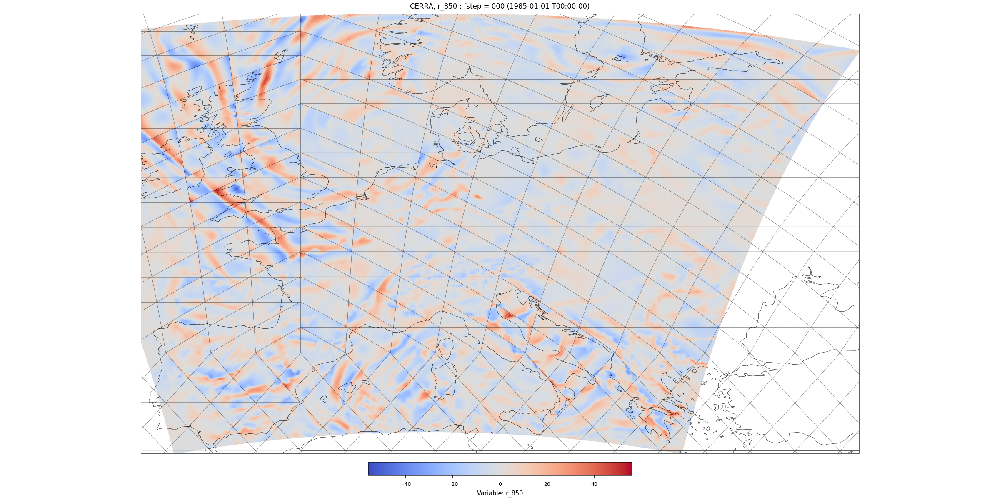 | 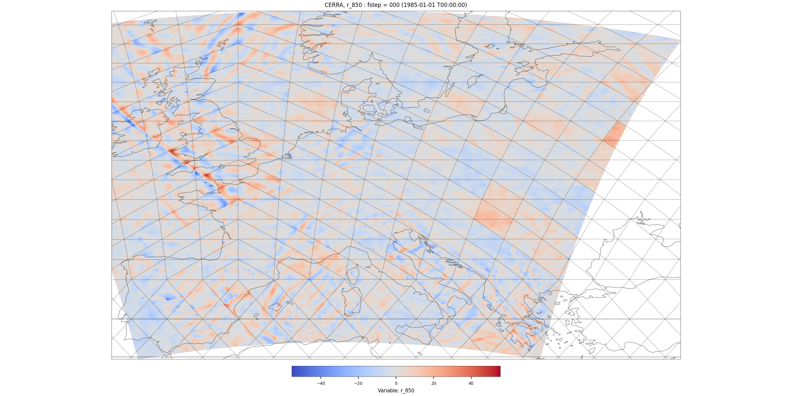 |

### Basic-coordinate geopotential maps

| Branch absolute slots — 21 | Global XYZ/Fourier — 22 |
|---|---|
|  | 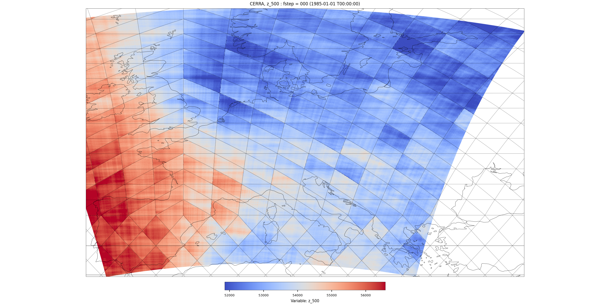 |
| 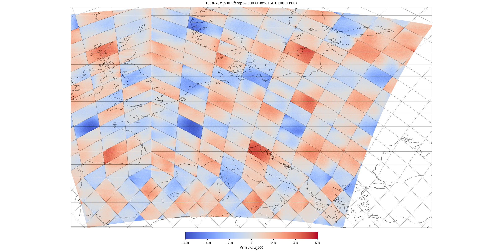 | 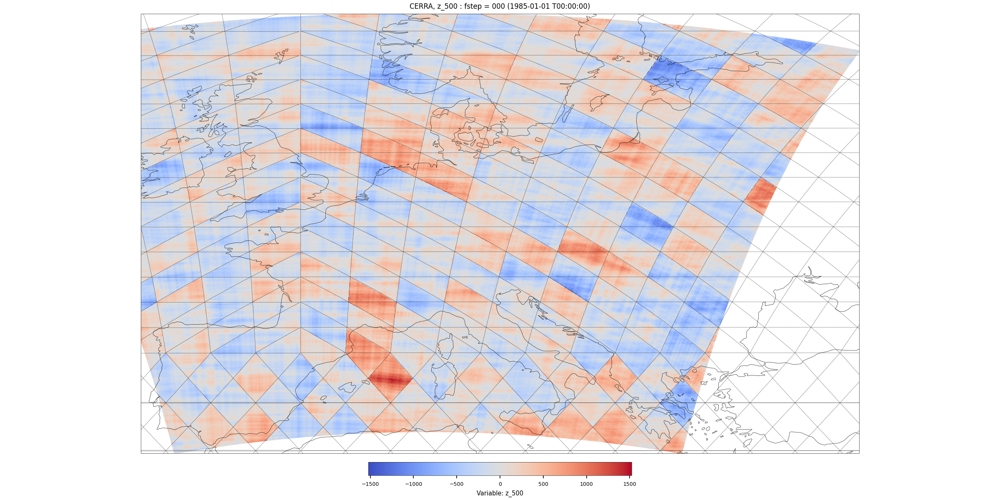 |

Target/reconstruction limits remain **r_850 [0, 100.107421875]** and **z_500 [51855.8828125, 56579.3828125]**. Residuals use separate symmetric scales; the geopotential residual colorbars span approximately ±600 for 21 versus ±1500 for 22. Compare the numeric errors as well as the colors.

### Basic-coordinate loss curves

Native mean MSE over both fields, with 260 training records and 11 validation snapshots per run. Both curves retain their initial transients and use their own logarithmic ranges. Final native validation and independent-inference MSE agree exactly.

| Branch absolute slots — 21 | Global XYZ/Fourier — 22 |
|---|---|
| 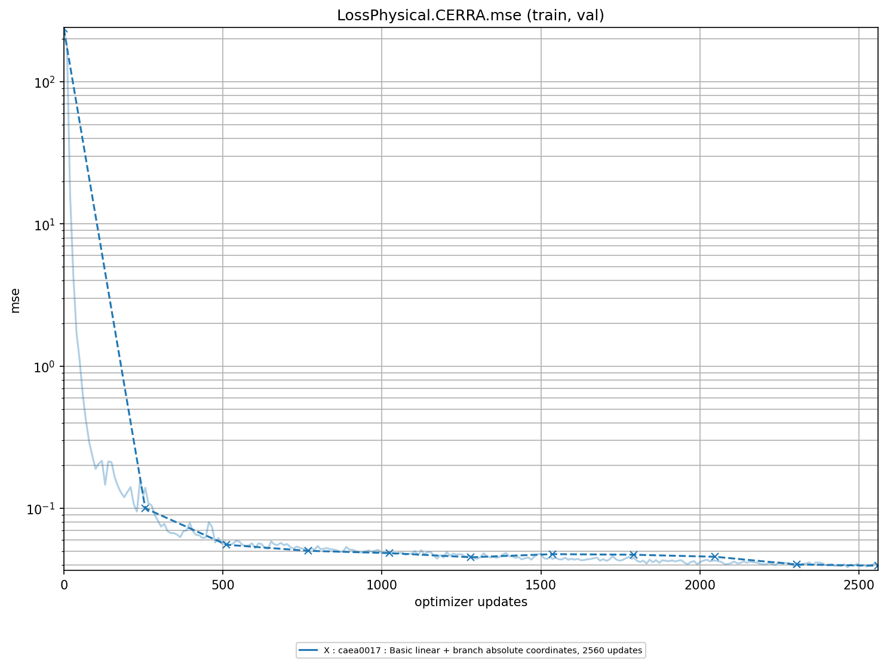 | 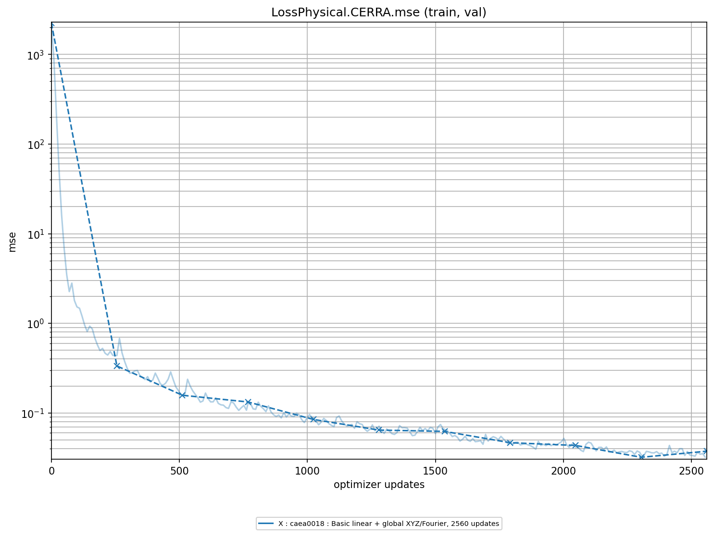 |

**Evidence:** 21 uses `caea0017` → `caei0017`, jobs **880787 / 880845**, 1,301 + 125 = **1,426 one-GPU seconds**. 22 uses `caea0018` → `caei0018`, jobs **880789 / 880847**, 1,139 + 97 = **1,236 one-GPU seconds**. Both final checkpoint-10 reloads completed once, without retraining; both remain below the 3,600-second ceiling. The unchanged scorer reports genuine numerical failures, not operational failures. Scores, native outputs and six maps per run are retained under `attempt-21/` and `attempt-22/`.

**Implementation check:** four focused coordinate/readout tests and Ruff pass. The new regression exercises both encodings through the native hard-owner-cell decoder with nonuniform cell latents; it preserves the reference's literal degree-valued trigonometry. No common checkpoint, initialization matching or extra provenance inventory was introduced for this pair.

## Experiments 23/24 — Per-cell queries with both coordinate encodings

**Change tested:** repeat 21/22 with **`ae_local_queries_per_cell: true`**. Everything else stays basic: **linear 105 → 128 coordinate embedding**, hard owning-cell readout, one 128-D latent per cell, bf16, constant LR 0.001, the same crop and **2,560 completed updates**. Both models have **1,857,922 parameters**, versus 285,186 with the shared query. No coordinate MLP, interpolation, common initialization or source-code change was added.

- **23:** unchanged **`decoder_absolute_coords: true`** from 21, including the reference commit's literal degree-valued sine/cosine slots and retained local features.
- **24:** unchanged **`decoder_global_coords: true`** from 22, with global XYZ and the same 96 Fourier features.

The pipelines `config/pipeline_cerra_ae_cellquery_absolute_branch.yml` and `config/pipeline_cerra_ae_cellquery_global_fourier.yml` reuse the existing base, per-cell-query override and basic coordinate overrides. Their `_inference.yml` counterparts reload checkpoint 10. Native fresh initialization is retained; 21/22 are historical shared-query controls, not new reruns or matched initial weights.

| Coordinate encoding | Query | Final native validation MSE | `r_850` RMSE | `r_850` boundary error | `z_500` RMSE | `z_500` boundary error |
|---|---|---:|---:|---:|---:|---:|
| Branch absolute — 21 | Shared | 0.03951514 | 33.43% | 42.06% | 12.85% | 15.81% |
| Branch absolute — **23** | **Per-cell** | **0.03638889** | **32.39%** | **41.61%** | **10.28%** | **14.19%** |
| Global XYZ/Fourier — 22 | Shared | 0.03747336 | 28.58% | 37.58% | 26.80% | 32.91% |
| Global XYZ/Fourier — **24** | **Per-cell** | **0.02826084** | **25.13%** | **33.10%** | **22.50%** | **25.35%** |

**Result:** both per-cell runs improve all four errors relative to their shared-query counterparts, but **all four 1% limits still fail** in each run. For the branch encoding, humidity RMSE / boundary errors fall **3.11% / 1.07%**, and geopotential errors fall **19.99% / 10.23%**. For global XYZ/Fourier, the reductions are **12.08% / 11.93%** and **16.06% / 22.98%**, respectively. These are observed single-run changes with more parameters and accepted initialization variability.

**Direct comparison:** with per-cell queries, global XYZ/Fourier lowers humidity RMSE / boundary errors by **22.42% / 20.44%** versus the branch encoding, while geopotential errors are **2.19× / 1.79× higher**. The humidity/geopotential tradeoff therefore remains.

**Observed:** both retain cell-aligned reconstruction seams and block-like geopotential residuals. Global XYZ/Fourier still shows within-cell ripples. Per-cell queries improve these fixed-budget metrics; they do not remove the artefacts.

### Per-cell-coordinate humidity maps

| Branch absolute + per-cell queries — 23 | Global XYZ/Fourier + per-cell queries — 24 |
|---|---|
|  |  |
| 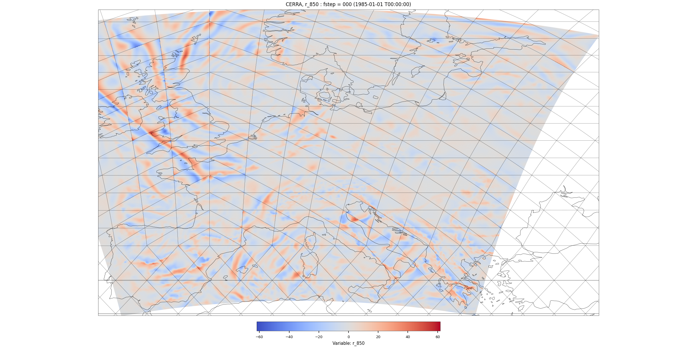 | 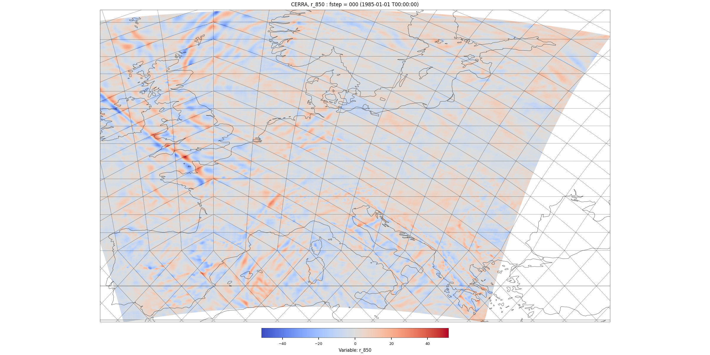 |

### Per-cell-coordinate geopotential maps

| Branch absolute + per-cell queries — 23 | Global XYZ/Fourier + per-cell queries — 24 |
|---|---|
| 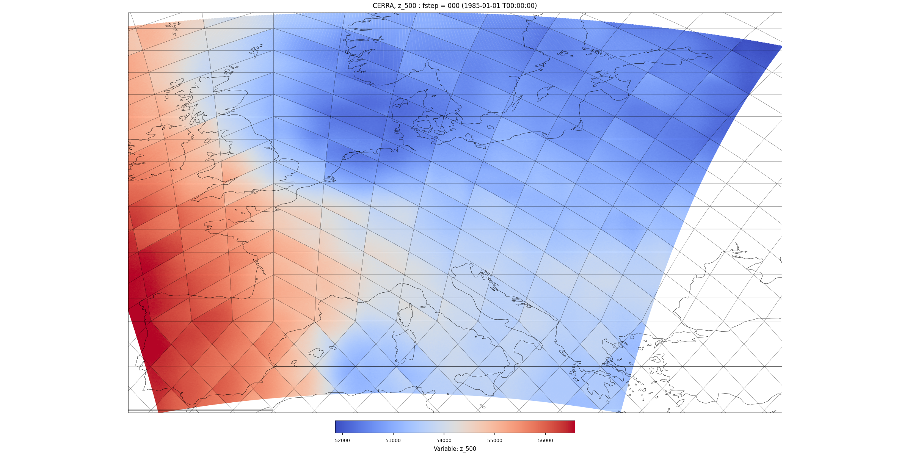 | 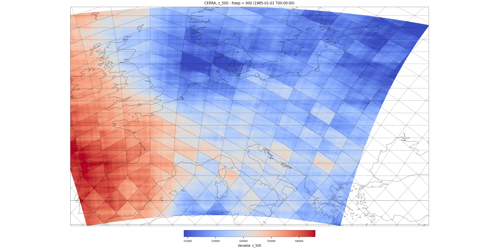 |
| 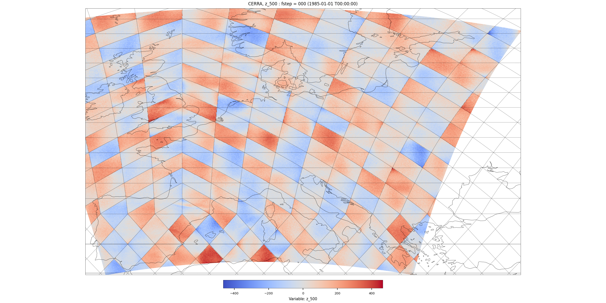 | 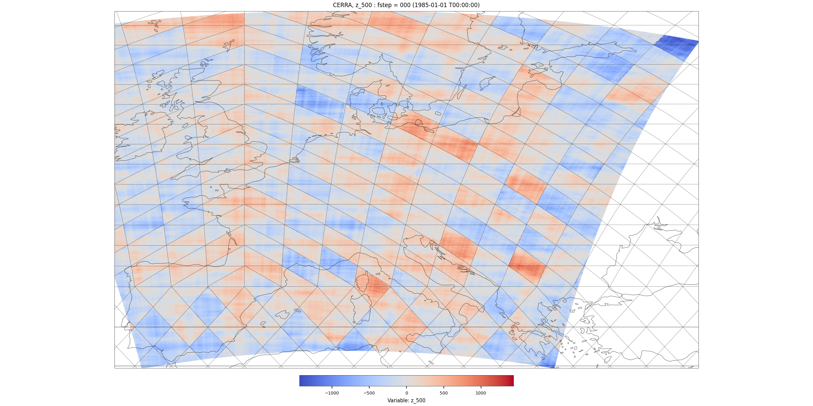 |

Target/reconstruction limits are unchanged: **r_850 [0, 100.107421875]** and **z_500 [51855.8828125, 56579.3828125]**. Residuals retain their own symmetric scales; compare the colorbars and numeric errors, not color intensity alone.

### Per-cell-coordinate loss curves

Native mean MSE over both fields, with **260 training records and 11 validation snapshots** per run. Initial transients are retained, without additional smoothing; logarithmic axes use their own ranges. Final native validation and independent-inference MSE agree exactly for both runs.

| Branch absolute + per-cell queries — 23 | Global XYZ/Fourier + per-cell queries — 24 |
|---|---|
| 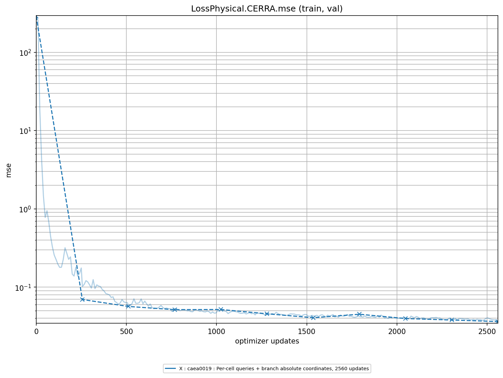 | 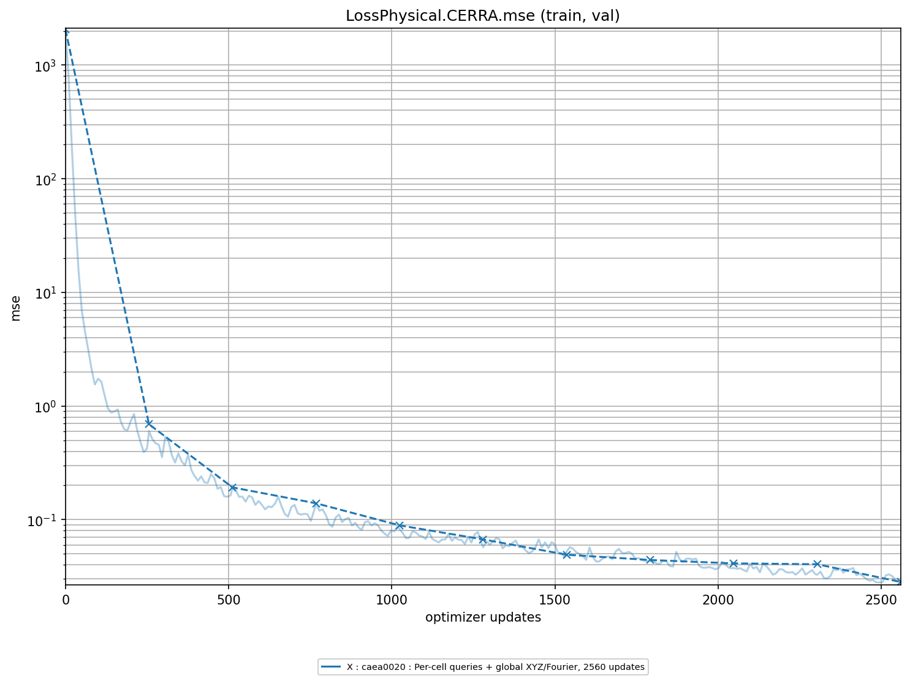 |

**Evidence:** 23 uses `caea0019` → `caei0019`, jobs **880909 / 881042**, 1,315 + 118 = **1,433 one-GPU seconds**. 24 uses `caea0020` → `caei0020`, jobs **880914 / 881043**, 1,177 + 93 = **1,270 one-GPU seconds**. Both training and inference jobs completed once, with no retraining or operational failures, below the 3,600-second ceiling. The unchanged scorer reports numerical failure. Exact scores, six native maps, losses and concise reports are retained under `attempt-23/` and `attempt-24/`.

## Experiment 25 — Fourier MLP without cell blending

**Change tested:** keep experiment 24's per-cell queries, global XYZ + 96 Fourier features and hard owning-cell readout, but replace its linear coordinate embedding with **experiment 14's MLP, 105 → 840 → 128**. This increases the native trainable count from 1,857,922 to **2,041,380**, matching 14. One 128-D latent per cell, nside32, bf16, constant LR 0.001, the crop, eight workers and **2,560 completed updates** are unchanged.

The saved configuration confirms **`decoder_type: Linear`**, **`decoder_global_coords: true`** and **`ae_local_queries_per_cell: true`**. Here `Linear` selects the native hard-cell bilinear decoder route, not the coordinate embedding's network type. Each target receives **only its owning cell's latent**; no interpolation indices, geometric weights or neighboring-cell blend are used.

The training pipeline `config/pipeline_cerra_ae_hard_fourier_mlp.yml` appends `config/cerra_ae_hard_fourier_mlp.yml` to 24's existing configuration stack. The override selects the unchanged MLP stream from 14. No model source code, initialization matching or checkpoint warmstart was added.

| Experiment | Coordinate net | Latent readout | Native validation MSE | `r_850` RMSE | `r_850` boundary | `z_500` RMSE | `z_500` boundary |
|---|---|---|---:|---:|---:|---:|---:|
| 24 | Linear 105→128 | Owning cell | 0.02826084 | 25.13% | 33.10% | 22.50% | 25.35% |
| **25** | **MLP 105→840→128** | **Owning cell** | **0.00097691** | **4.97%** | **7.82%** | **3.30%** | **5.46%** |
| 14 | MLP 105→840→128 | Four-cell interpolation | 0.00189353 | 6.89% | 3.65% | 4.68% | 1.85% |

**Against 24:** the MLP-only architecture change lowers humidity RMSE / boundary error by **80.23% / 76.38%** and geopotential errors by **85.34% / 78.45%**. Native mean MSE is **28.93× lower**. Strong reconstruction therefore returns without restoring cell blending.

**Against 14:** this hard-cell run has **27.92% / 29.46% lower RMSE**, but **2.14× / 2.95× higher boundary errors**, for humidity / geopotential. This separates low pointwise error from seam suppression: interpolation is not required for the observed low-single-digit RMSE, but the interpolated run has smaller boundary jumps. Initializations differ; one run per configuration does not establish seed robustness or prove that removing interpolation generally improves RMSE. **All four 1% criteria still fail.**

### Hard-cell MLP field maps

The reconstructions recover humidity filaments and the broad geopotential gradient. Residuals retain fine texture and cell-aligned offsets; the quantitative boundary errors remain well above acceptance. Target/reconstruction ranges remain **r_850 [0, 100.107421875]** and **z_500 [51855.8828125, 56579.3828125]**. Residual maps use separate symmetric scales.

| Map | r_850 | z_500 |
|---|---|---|
| Target |  |  |
| Reconstruction |  | 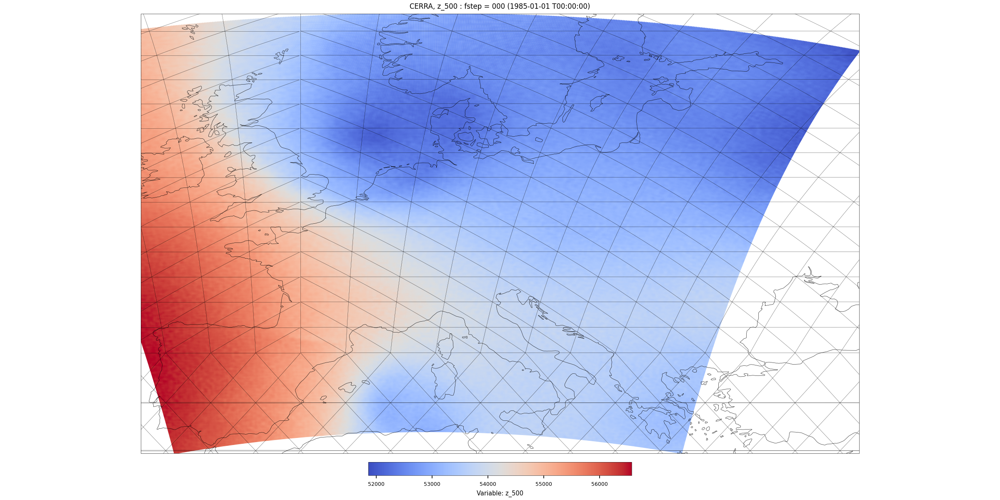 |
| Residual | 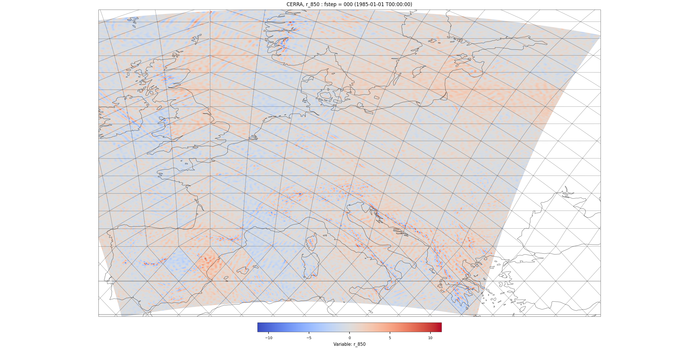 | 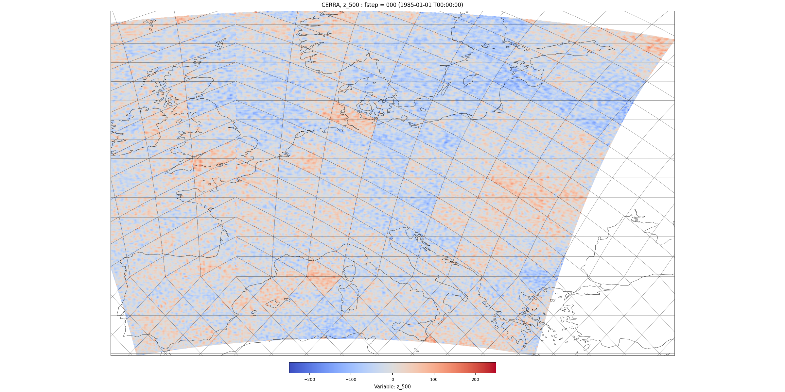 |

### Hard-cell MLP loss curve

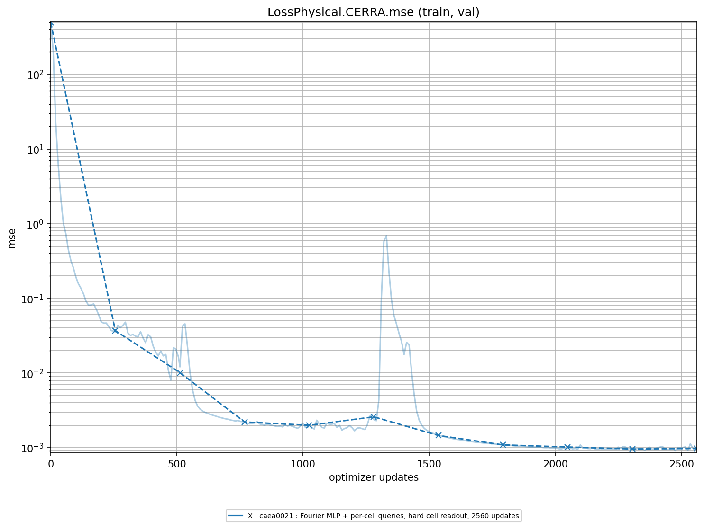

The native curve contains **260 training records and 11 validation snapshots**. Initial transients and a large training spike around update 1,300 remain visible, without extra smoothing. Final validation and independently reloaded inference both give **0.0009769137250259519** mean MSE; this does not replace the per-variable acceptance criteria.

**Evidence:** `caea0021` → `caei0021`, final checkpoint **10**, saved `general.istep=2560`, all weights matching on native reload. Jobs **881062 / 881129** completed once; **1,161 + 123 = 1,284 one-GPU seconds (21m24s)**, below 3,600 seconds. The unchanged scorer returned numerical failure, not an operational error. Exact commands, allocation records, results, six native maps, losses and findings are retained under `attempt-25/`. No retraining or extra variant was run.

## Experiments 26/27 — Shared-query MLP encoding ablation

`config/pipeline_cerra_ae_shared_query_encoding_ablation.yml` compares **global XYZ/Fourier** with **Tameer's literal branch-absolute features** (`decoder_absolute_coords: true`, including the degree-valued trigonometry described in experiment 21). Both arms retain the **105 → 840 → 128 coordinate MLP**, one shared **1 × 1 × 128** learned query, hard owning-cell readout, **468,644 trainable parameters**, the same single-sample crop/channels, bf16, constant LR 0.001 and **2,560 updates**. Unlike 21/22, the coordinate embedding is an MLP, not linear. Initializations are fresh, not matched.

| Experiment | Encoding | Training → inference run | Training / inference jobs | Final validation / reload MSE |
|---|---|---|---|---:|
| **26** | Global XYZ/Fourier | `bng2bt0q` → `xy18hzc2` | **885666 / 885735** | 0.00113997 |
| **27** | Tameer branch absolute | `ad6uex5q` → `iv4lmlyh` | **885667 / 885737** | 0.01582671 |

Both jobs were initially submitted to `debug`. All four debug nodes were drained, so, at the user's request, the **existing jobs were moved to `normal`**, preserving IDs and resource limits; the pipeline now also selects `normal`. Both completed **2,560 updates** on `nid005161`. Separate native inference jobs on `nid005179` reloaded **checkpoint 10 with all weights matching** and reproduced both per-variable and mean final validation MSE exactly.

**Result:** neither run passes any 1% criterion. Against the absolute encoding, Fourier reduces humidity RMSE / boundary error by **75.27% / 66.98%**; geopotential RMSE is **3.23% higher**, while its boundary error is **3.45% lower**. Per-cell-query Fourier experiment **25** remains better than shared-query Fourier **26** on all four measures. These are single-run comparisons, not seed-robust causal claims.

**Evidence:** training plus inference used **1,195 + 241 = 1,436** one-GPU seconds for 26 and **1,365 + 241 = 1,606** for 27, each below 3,600 seconds. The unchanged float64 scorer verified the original source values, full crop, timestamp and **21,141** boundary pairs. Numerical acceptance failed, not execution. Metrics and concise result records are in `attempt-26/` and `attempt-27/`; no retraining was performed.

Pre-submission checks loaded the native configurations and sampler metadata, confirmed equal model tensor shapes/budgets, and exercised both coordinate encodings through the native CPU MLP/bilinear readout and backward pass with finite, nonzero shared-query gradients. No model source changes or common-initialization machinery were added. Native artifacts use the run-specific shared-work directories above.

## AdaLN initialization finding

The separately requested investigation confirmed and fixed two defects in gated AdaLN: resets overwrote zero modulation, and positional dropout arguments were used as LayerNorm epsilon. **Seven focused regression checks pass; all seven failed before the fix.** The completed CERRA checkpoints have no adaptive-normalization parameters, so these defects do not explain their seams or invalidate the matched comparison.

See [AdaLN initialization defects](adaln_initialization.md) for reproduction, affected paths, verification scope and the warning that corrected epsilon can change outputs of older gated-AdaLN checkpoints.

## Reproducibility, artifacts and resource rules

- Working branch: `rradev/decoder_artefacts`. Reference: `rradev/cerra_decode_split` at `f6d12de96e1b01208b0e45f0056df8ccf1ccc6a9`, using its CERRA `r_850` / `z_500` setup.
- Source data: `/capstor/store/cscs/userlab/ch17/data/cerra-rr-an-oper-se-al-ec-mars-5p5km-1985-2023-3h-v2.zarr`. Source values' SHA-256 is `9fb2d9c0dae456cbc80a22106ffff8651169dfe4791af511d252950c521ae411` for all eighteen runs.
- Artifact root: `/capstor/scratch/cscs/rradev/cerra_decoder_artefacts/`. Completed experiments through 18 retain full configuration/environment/hash records, Slurm accounting, independent metrics, plots and lessons. Experiments 19–25 retain their native results, concise comparisons and requested field/loss plots, without further provenance inventories. Experiments 26/27 retain native checkpoint-reload results and independent scores. Setup failures remain recorded and count conservatively against the **32-attempt** ceiling.
- Native physical-field plots: `attempt-NN/independent_plots/plots/CERRA/maps/{targets,preds_ens_0,bias_ens_0}/`. `z_500` target/reconstruction limits are [51855.8828125, 56579.3828125]; residuals use separate symmetric scales.
- Base configuration: `config/cerra_autoencoding.yml`; stream: `config/streams/cerra_autoencoding/cerra.yml`; evaluation: `config/evaluate/eval_cerra_autoencoding.yml`. The matched linear override and stream are `config/cerra_ae_linear.yml` and `config/streams/cerra_ae_linear/cerra.yml`. Use archived/effective configurations to reproduce historical runs, not a later working configuration.
- Use existing WeatherGenerator training, inference and evaluation entrypoints. Submit every GPU operation through `../WeatherGenerator-private/`; **no login-node GPU computation** and no standalone autoencoder or training runner. Source datasets and unrelated user changes remain untouched.
- Every experiment gets **one GPU**, with **at most one hour of summed training plus independent-inference allocation**. Parallel experiments are permitted, with isolated artifacts and budgets. No run below 2,560 completed updates is eligible for the final matched comparison.
- Native fresh-run initialization varies; 19/20 use the common untrained weights prepared for their ablation. Do not claim bitwise-identical training or seed robustness. The requested hard-cell MLP experiment 25 is complete; broader experiment search remains paused.

| Experiment | Training / inference jobs | Final checkpoint | Effective data seed |
|---|---|---|---:|
| 05 | 879329 / 879349 | `caea0001_chkpt00004.chkpt` | 1790091231 |
| 06 | 879353 / 879362 | `caea0002_chkpt00010.chkpt` | 1790093264 |
| 09 | 879379 / 879389 | `caea0005_chkpt00010.chkpt` | 1790096950 |
| 11 | 880260 / 880315 | `caea0007_chkpt00010.chkpt` | 1790156423 |
| 12 | 880259 / 880307 | `caea0008_chkpt00010.chkpt` | 1790156423 |
| 13 | 880356 / 880388 | `caea0009_chkpt00010.chkpt` | 1790160011 |
| 14 | 880355 / 880396 | `caea0010_chkpt00010.chkpt` | 1790160011 |
| 17 | 880411 / 880433 | `caea0013_chkpt00010.chkpt` | 1790163720 |
| 18 | 880412 / 880432 | `caea0014_chkpt00010.chkpt` | 1790163720 |
| 19 | 880741 / 880770 | `caea0015_chkpt00010.chkpt` | — |
| 20 | 880740 / 880773 | `caea0016_chkpt00010.chkpt` | — |
| 21 | 880787 / 880845 | `caea0017_chkpt00010.chkpt` | — |
| 22 | 880789 / 880847 | `caea0018_chkpt00010.chkpt` | — |
| 23 | 880909 / 881042 | `caea0019_chkpt00010.chkpt` | — |
| 24 | 880914 / 881043 | `caea0020_chkpt00010.chkpt` | — |
| 25 | 881062 / 881129 | `caea0021_chkpt00010.chkpt` | — |
| 26 | 885666 / 885735 | `bng2bt0q_chkpt00010.chkpt` | 1790328410 |
| 27 | 885667 / 885737 | `ad6uex5q_chkpt00010.chkpt` | 1790328410 |

Checkpoints live under `/iopsstor/scratch/cscs/thunter/shared_work/models/<training-run>/`; native inference outputs under the corresponding `results/<inference-run>/`. Independent inference writes `validation_chkpt00000_rank0000.zarr` regardless of the loaded training checkpoint epoch. No acceptance threshold, crop or boundary mask has been relaxed.
