# CERRA r_850 — visual architecture comparison

All **17 completed 2,560-update runs**, ordered from the basic shared-query models to per-cell-query and interpolated variants. Only **r_850** is shown. Historical figures are reused unchanged; the new **26/27** maps were rendered with the native evaluator from their existing independently reloaded outputs. No training or inference was rerun. The 400-update exploratory run 05 is excluded from this matched-step table.

- **Linear / MLP** describes the target-coordinate embedding; every run retains the learned bilinear decoder and one **128-D latent per HEALPix cell**.
- **Per-cell queries: no** means the learned encoder query is shared across cells, not that the output latent is shared. **Cell blend: no** uses only the owning cell's latent; **four-cell** uses the geometric weighted blend of four neighboring latents before decoding.
- **Absolute branch** means the referenced branch's four absolute trigonometric slots, applied literally to degree-valued coordinates while retaining the other original cell-local features. **Global XYZ + Fourier** means owner-independent XYZ/time plus 96 global sine/cosine features; it is a different encoding.
- All field maps use the same target-derived color limits, **[0, 100.107421875]**, with HEALPix boundaries overlaid. Click a figure for full resolution.
- **RMSE** and **boundary error** are percentages of the target crop's spatial standard deviation. Boundary error measures jumps in the residual across HEALPix boundaries, not natural target gradients. Both must be **≤1%**; no run passes for r_850. These are single runs, not statistically replicated rankings.

| Run and configuration | r_850 target / reconstruction | RMSE | Boundary error |
|---|---|---:|---:|
| **Shared target** CERRA, 1985-01-01T00:00 534 × 534 contiguous crop | [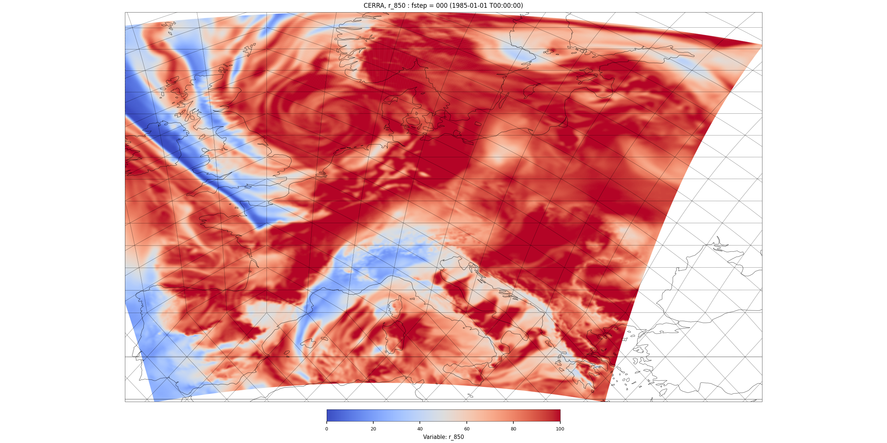](figures/cerra_decoder_artefacts/r850_target.png) | — | — |
| **09 — basic linear** Coordinates: original cell-local Embedding: linear 105 → 128 Per-cell queries: **no** Cell blend: **no** | [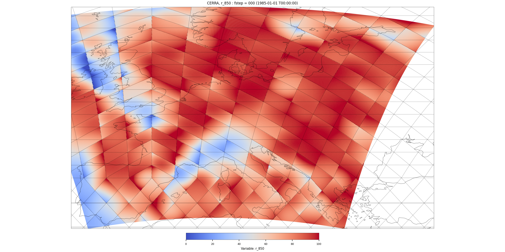](figures/cerra_decoder_artefacts/r850_linear_2560.png) | 40.23% | 48.30% |
| **06 — basic MLP** Coordinates: original cell-local Embedding: MLP 105 → 840 → 128 Per-cell queries: **no** Cell blend: **no** | [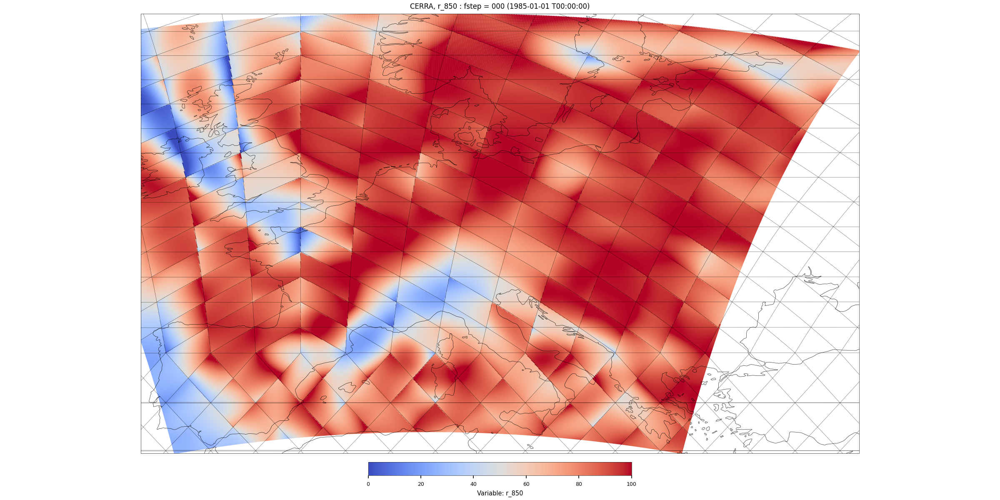](figures/cerra_decoder_artefacts/r850_mlp_2560.png) | 34.89% | 46.50% |
| **22 — Fourier, shared query** Coordinates: global XYZ + Fourier Embedding: linear 105 → 128 Per-cell queries: **no** Cell blend: **no** | [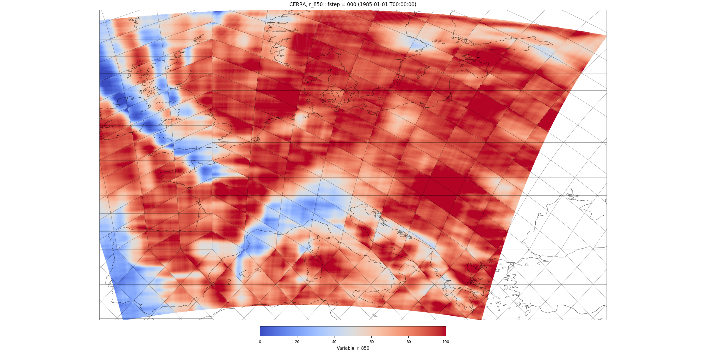](figures/cerra_decoder_artefacts/r850_basic_global_fourier_2560.png) | 28.58% | 37.58% |
| **21 — absolute coordinates, shared query** Coordinates: absolute branch Embedding: linear 105 → 128 Per-cell queries: **no** Cell blend: **no** | [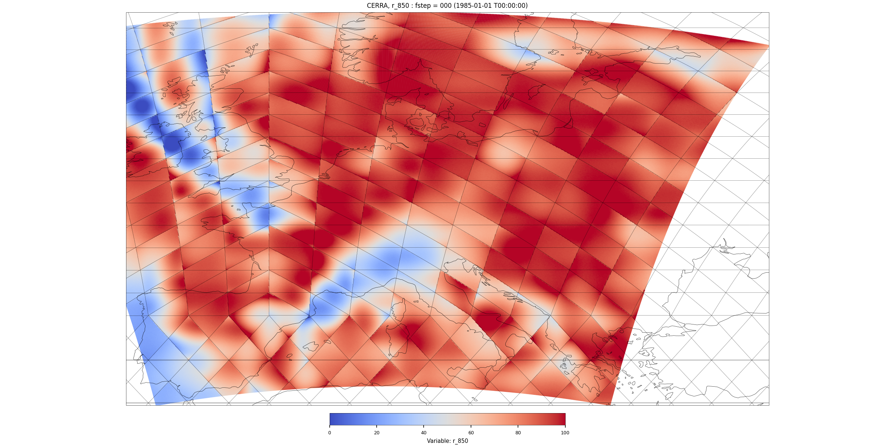](figures/cerra_decoder_artefacts/r850_basic_absolute_branch_2560.png) | 33.43% | 42.06% |
| **26 — Fourier MLP, shared query** Coordinates: global XYZ + Fourier Embedding: MLP 105 → 840 → 128 Per-cell queries: **no** Cell blend: **no** |  | 5.37% | 8.67% |
| **27 — absolute MLP, shared query** Coordinates: Tameer absolute branch Embedding: MLP 105 → 840 → 128 Per-cell queries: **no** Cell blend: **no** |  | 21.70% | 26.26% |
| **11 — local MLP, per-cell queries** Coordinates: original cell-local Embedding: MLP 105 → 840 → 128 Per-cell queries: **yes** Cell blend: **no** | [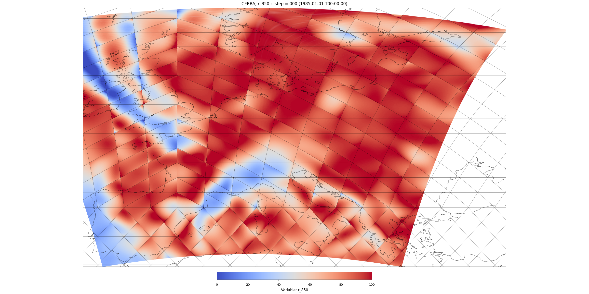](figures/cerra_decoder_artefacts/r850_cellqueries_2560.png) | 30.41% | 38.93% |
| **24 — Fourier linear, per-cell queries** Coordinates: global XYZ + Fourier Embedding: linear 105 → 128 Per-cell queries: **yes** Cell blend: **no** | [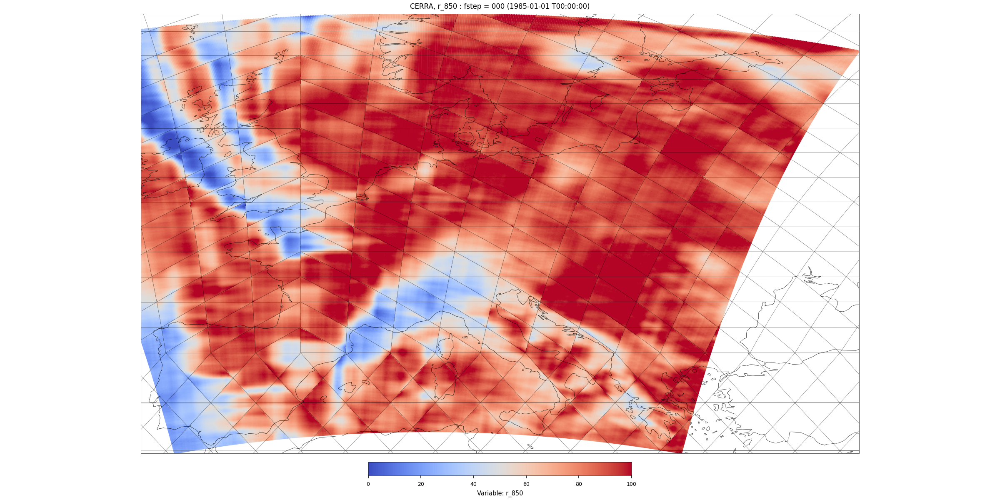](figures/cerra_decoder_artefacts/r850_cellquery_global_fourier_2560.png) | 25.13% | 33.10% |
| **23 — absolute coordinates, per-cell queries** Coordinates: absolute branch Embedding: linear 105 → 128 Per-cell queries: **yes** Cell blend: **no** |  | 32.39% | 41.61% |
| **25 — Fourier MLP, no blending** Coordinates: global XYZ + Fourier Embedding: MLP 105 → 840 → 128 Per-cell queries: **yes** Cell blend: **no** | [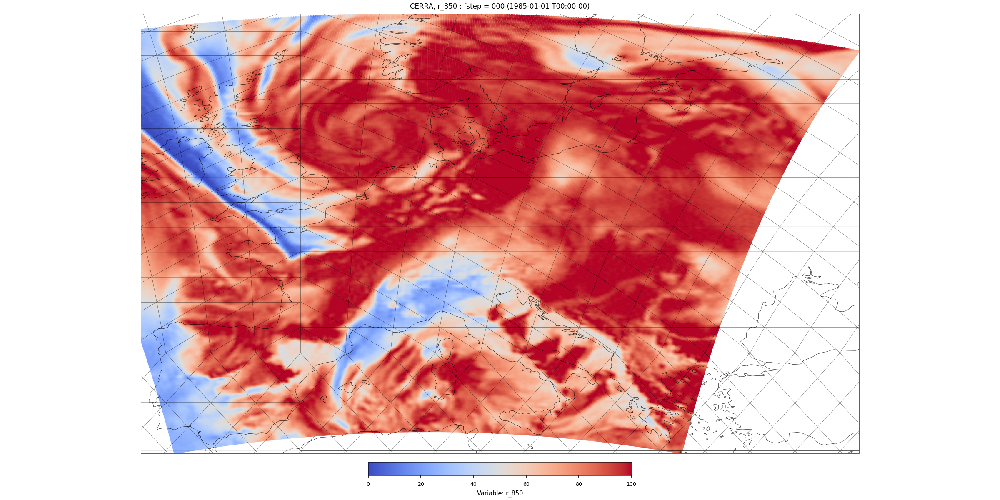](figures/cerra_decoder_artefacts/r850_hard_fourier_mlp_2560.png) | 4.97% | 7.82% |
| **12 — XYZ MLP, shared query, blended** Coordinates: global XYZ/time, no Fourier Embedding: MLP 9 → 840 → 128 Per-cell queries: **no** Cell blend: **four-cell** | [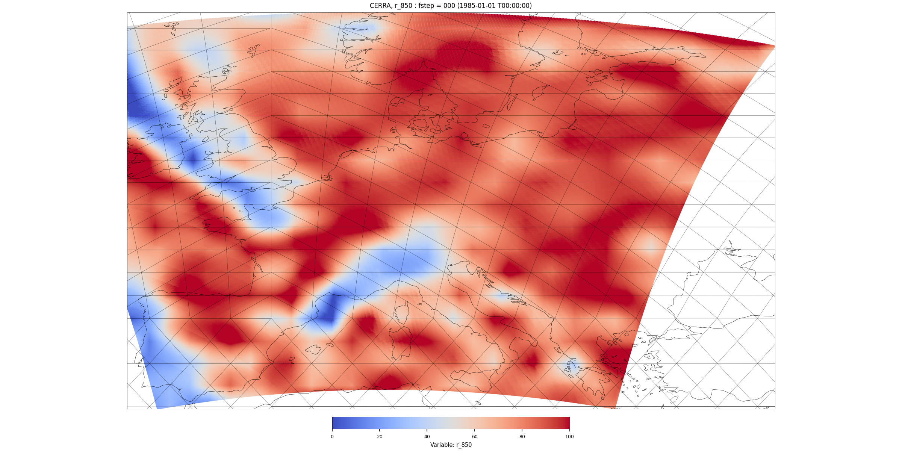](figures/cerra_decoder_artefacts/r850_interpolated_2560.png) | 45.91% | 9.32% |
| **13 — XYZ MLP, per-cell queries, blended** Coordinates: global XYZ/time, no Fourier Embedding: MLP 9 → 840 → 128 Per-cell queries: **yes** Cell blend: **four-cell** | [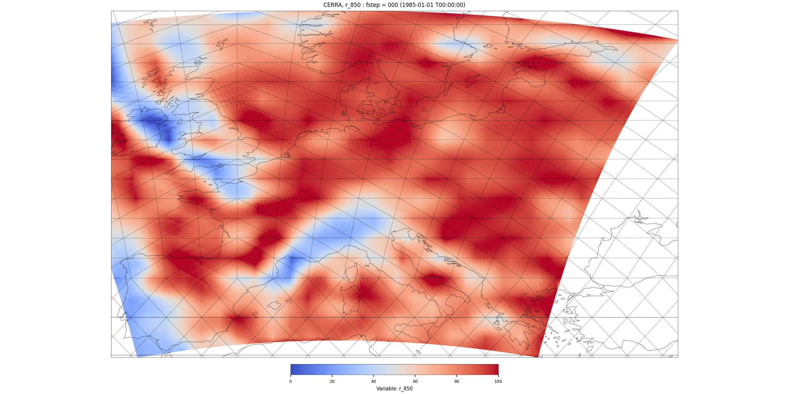](figures/cerra_decoder_artefacts/r850_interpolated_cellqueries_2560.png) | 40.82% | 9.31% |
| **14 — Fourier MLP, blended** Coordinates: global XYZ + Fourier Embedding: MLP 105 → 840 → 128 Per-cell queries: **yes** Cell blend: **four-cell** | [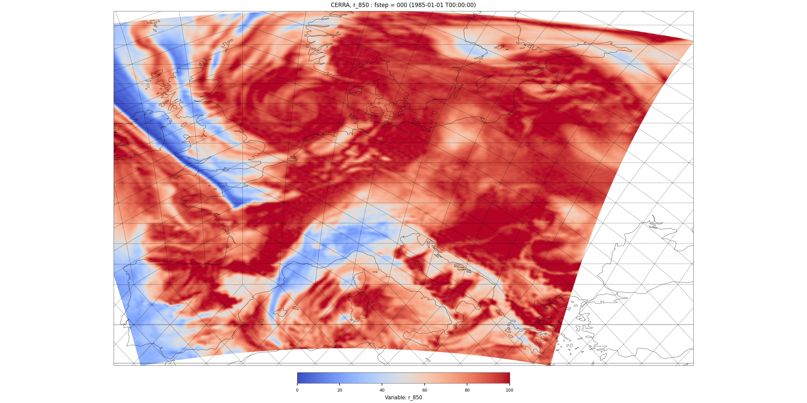](figures/cerra_decoder_artefacts/r850_fourier_cellqueries_2560.png) | 6.89% | **3.65%** |
| **17 — Fourier MLP, FP32 readout** Coordinates: global XYZ + Fourier Embedding: MLP 105 → 840 → 128 Per-cell queries: **yes** Cell blend: **four-cell** FP32 coordinate embedding and readout; attention stays bf16 |  | **4.80%** | 3.71% |
| **18 — Fourier MLP, FP32 + LR decay** Coordinates: global XYZ + Fourier Embedding: MLP 105 → 840 → 128 Per-cell queries: **yes** Cell blend: **four-cell** Same precision as 17; linear LR decay 0.001 → 0.00001 |  | 5.37% | 4.00% |
| **19 — Fourier ON ablation** Coordinates: global XYZ + Fourier Embedding: MLP 105 → 840 → 128 Per-cell queries: **yes** Cell blend: **four-cell** Same architecture as 14; bf16, constant LR 0.001 |  | 4.87% | 3.78% |
| **20 — Fourier OFF ablation** Coordinates: global XYZ/time + 96 zeroed Fourier slots Embedding: MLP 105 → 840 → 128 Per-cell queries: **yes** Cell blend: **four-cell** Same network width as 19; bf16, constant LR 0.001 | [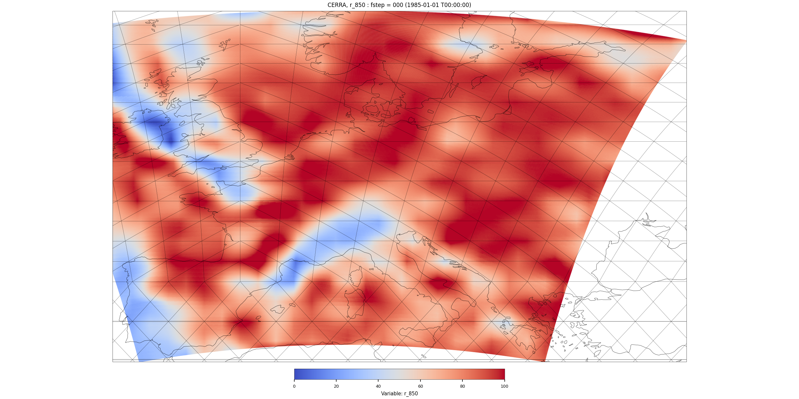](figures/cerra_decoder_artefacts/r850_fourier_ablation_off_2560.png) | 39.71% | 9.13% |

Bold error values identify the lowest observed RMSE and boundary error, not passing results. Learning rate is constant 0.001 and coordinate/readout execution uses the native bf16 autocast setting unless a row states otherwise. Runs 19/20 share their prepared untrained weights; the other comparisons accept native initialization differences. Exact metrics, run IDs, checkpoint evidence and configuration details remain in the [full report](cerra_decoder_artefacts.md).
